# Laporan Pratikum 10
Syahla' Syafiqah Fayra - TI 1F - 2141720015

## 8.2.3 Pertanyaan
1. Pada konstruktor, mengapa nilai awal atribut front dan rear bernilai -1, sementara atribut size bernilai 0?
    
    ### Jawaban :
        Karena front dan rear merupakan variabel yang berguna untuk menyimpan nomor indeks yang dimana nilai kosong sama dengan -1, sedangkan size digunakan untuk menyimpan nilai nyata yang dimana nilai kosong sama dengan 0
            
2. Pada method Enqueue, jelaskan maksud dan kegunaan dari potongan kode berikut!

    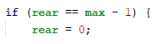

    ### Jawaban :
        Kode tersebut berguna untuk proses pengecekan posisi rear apakah berada di array index terakhir, jika benar maka posisi rear akan berada di indeks ke 0

3. Pada method Dequeue, jelaskan maksud dan kegunaan dari potongan kode berikut!

    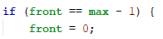

    ### Jawaban :
        Kode tersebut berguna untuk mengecek apakah front sama dengan array posisi terakhir, jika benar maka posisi front akan berada di diindeks 0


4. Pada method print, mengapa pada proses perulangan variabel i tidak dimulai dari 0 (int i=0), melainkan int i=front?

    ### Jawaban :
        Karena Front tidak harus mulai dari indeks 0, bisa dari yang lain tergantung posisi awal

5. Perhatikan kembali method print, jelaskan maksud dari potongan kode berikut!

    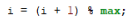

    ### Jawaban :
        Kode Tersebut berguna untuk proses looping sampai semua array telah diproses. 

6. Tunjukkan potongan kode program yang merupakan queue overflow!

    ### Jawaban :

    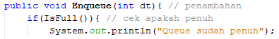

7. Pada saat terjadi queue overflow dan queue underflow, program tersebut tetap dapat berjalan dan hanya menampilkan teks informasi. Lakukan modifikasi program sehingga pada saat terjadi queue overflow dan queue underflow, program dihentikan!

    ### Jawaban:

    - Modifikasi Kode

        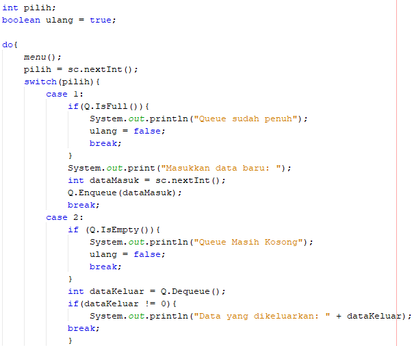

        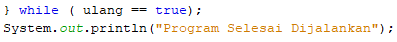

    - Hasil Run

        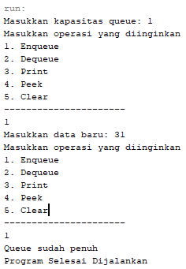

        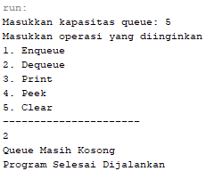


## 8.2.3 Pertanyaan
1. Pada class QueueMain, jelaskan fungsi IF pada potongan kode program berikut!

    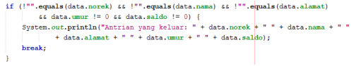

    ### Jawaban :
        Potongan kode tersebut adalah proses pengecekan apakah semua data yang ada tidak bernilai kosong, jika ada maka proses tersebut tidak akan ditampilkan sedangkan jika tidak ada yang kosong maka lanjut ke proses selanjutnya yaitu mengeluarkan output antrian yang keluar

2. Lakukan modifikasi program dengan menambahkan method baru bernama peekRear pada class Queue yang digunakan untuk mengecek antrian yang berada di posisi belakang! Tambahkan pula daftar menu 5. Cek Antrian paling belakang pada class QueueMain sehingga method peekRear dapat dipanggil!

    ### Jawaban : 

    - kode method peekRear

        ``` java
        public void peekRear() {
                if (!isEmpty()) {
                    System.out.println("Elemen terakhir : " 
                            + data[rear].norek + " " 
                            + data[rear].nama + " " 
                            + data[rear].alamat + " " 
                            + data[rear].umur + " " 
                            + data[rear].saldo);
                } else {
                    System.out.println("Queue masih kosong");
                }
            }
        ```

    - kode queueMain

        ``` java
        case 4:
                            antri.peekRear();
                            break;
        ```
    - Hasil Run 

        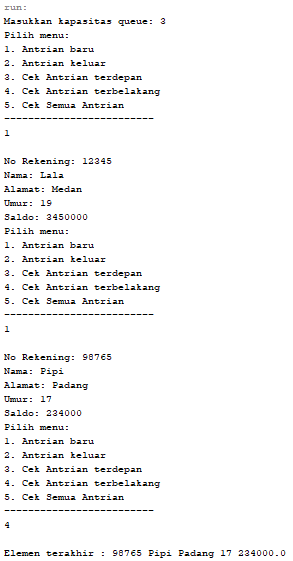

## 8.4 Tugas
1. Tambahkan dua method berikut ke dalam class Queue pada Praktikum 1:

    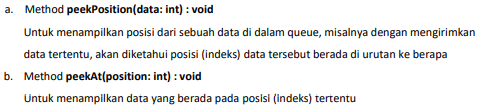

    Sesuaikan daftar menu yang terdapat pada class QueueMain sehingga kedua method tersebut dapat dipanggil!

    ### Jawaban :

    - Kode Program

        ``` java
        public void peekPosition(int n){
                if (!IsEmpty()) {
                    for (int i = 0; i < max; i++) {
                        if (data[i] == n) {
                            System.out.println("Elemen berada pada indeks ke : " + i + " yaitu data ke " + (i + 1));
                        }
                    }
                }
            }
            
            public void peekAt(int position){
            for (int i = 0; i < max; i++) {
                    if (i == position) {
                        System.out.println("Data dari indeks tersebut adalah : " + data[position]);
                    }
                }  
            }
        ```
    
    - Hasil Program

        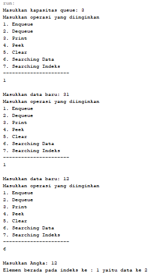

        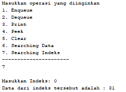

2. Buatlah program antrian untuk mengilustasikan mahasiswa yang sedang meminta tanda tangan KRS pada dosen DPA di kampus. Ketika seorang mahasiswa akan mengantri, maka dia harus menuliskan terlebih dulu NIM, nama, absen, dan IPK seperti yang digambarkan pada Class diagram berikut:

    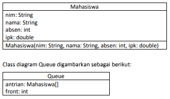

    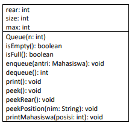

    Keterangan:
    - Method create(), isEmpty(), isFull(), enqueue(), dequeue() dan print(), kegunaannya sama seperti yang telah dibuat pada Praktikum
    - Method peek(): digunakan untuk menampilkan data Mahasiswa yang berada di posisi antrian paling depan
    - Method peekRear(): digunakan untuk menampilkan data Mahasiswa yang berada di posisi antrian paling belakang
    - Method peekPosition(): digunakan untuk menampilkan posisi antrian ke berapa, seorang Mahasiswa berada. Pengecekan dilakukan berdasarkan NIM
    -  Method printMahasiswa(): digunakan untuk menampilkan data mahasiswa pada suatu posisi tertentu dalam antrian

    ### Jawaban : 

    - Kode Program Mahasiswa

        ``` java
        public class mahasiswa {
            String nim;
            String nama;
            int absen;
            double ipk;
            
            mahasiswa(){
                
            }
            
            mahasiswa(String nim, String nama, int absen, double ipk){
                this.nim = nim;
                this.nama = nama;
                this.absen = absen;
                this.ipk = ipk;
            }
            
        }
        ```

    - kode Program Queue

        ``` java
        public class queue {
            mahasiswa[] data; 
            int front;
            int rear;
            int size;
            int max;
            
            public queue(int n) { // data awal
                max = n;
                data = new mahasiswa[max];
                size = 0;
                front = rear = -1;
            }
            
            public boolean isEmpty() {
                if (size == 0) {
                    return true;
                } else {
                    return false;
                }
            }
            
            public boolean isFull() {
                if (size == max) {
                    return true;
                } else {
                    return false;
                }
            }
            
            public void Enqueue(mahasiswa m) {
                if (isFull()) {
                    System.out.println("Queue sudah penuh");
                } else {
                    if (isEmpty()) {
                        front = rear = 0;
                    } else {
                        if (rear == max - 1) {
                            rear = 0;
                        } else {
                            rear++;
                        }
                    }
                    data[rear] = m;
                    size++;
                }
            }
            
            public mahasiswa Dequeue() {
                mahasiswa m = new mahasiswa();
                if (isEmpty()) {
                    System.out.println("Queue masih kosong");
                } else {
                    m = data[front];
                    size--;
                    if (isEmpty()) {
                        front = rear = -1;
                    } else {
                        if (front == max - 1) {
                            front = 0;
                        } else {
                            front++;
                        }
                    }
                }
                return m; // nilai dt akan dikembalikan
            }
            
            public void print() {
                if (isEmpty()) {
                    System.out.println("Queue masih kosong");
                } else {
                    int i = front;
                    while (i != rear) {
                        System.out.println("NIM   :" + data[i].nim);
                        System.out.println("Nama  :" + data[i].nama);
                        System.out.println("Absen :" + data[i].absen);
                        System.out.println("IPK   :" + data[i].ipk);
                        System.out.println("--------------------------------------------");
                        i = (i + 1) % max;
                    }
                    System.out.println("NIM   :" + data[i].nim);
                    System.out.println("Nama  :" + data[i].nama);
                    System.out.println("Absen :" + data[i].absen);
                    System.out.println("IPK   :" + data[i].ipk);
                    System.out.println("--------------------------------------------");
                    System.out.println("Jumlah elemen : " + size);
                }
            }
            
            public void peek() {
                if (!isEmpty()) {
                    System.out.println("Mahasiswa terdepan : ");
                    System.out.println("NIM   :" + data[front].nim);
                    System.out.println("Nama  :" + data[front].nama);
                    System.out.println("Absen :" + data[front].absen);
                    System.out.println("IPK   :" + data[front].ipk);
                } else {
                    System.out.println("Queue masih kosong");
                }
            }
            
            public void peekRear() {
                if (!isEmpty()) {
                    System.out.println("Mahasiswa terakhir : ");
                    System.out.println("NIM   :" + data[rear].nim);
                    System.out.println("Nama  :" + data[rear].nama);
                    System.out.println("Absen :" + data[rear].absen);
                    System.out.println("IPK   :" + data[rear].ipk);
                } else {
                    System.out.println("Queue masih kosong");
                }
            }
            
            public void peekPosition (String nim){
                if (!isEmpty()) {
                    boolean isFound = false;
                    int i = front;
                        for (; i != rear; i = (i + 1) % max) {
                            if (data[i].nim.equals(nim)) {
                                isFound = true;
                                break;
                            }
                        }
                            if (data[i].nim.equals(nim)) isFound = true;
                            if (isFound) System.out.println("Mahasiswa dengan nim " + nim + " ada di posisi " + i);
                            else System.out.println("Mahasiswa dengan nim " + nim + " tidak ada");
                } else {
                    System.out.println("Antrian masih kosong");
                }
            }
            
            
            public void printMahasiswa(int posisi){
                int id;
                if (rear >= front){
                id = posisi - 1;
                }else {
                    id = posisi + front -1;
                    if(id>max){
                        id -= max;
                    }
                }
                System.out.println("NIM\t : " + data[id].nim);
                System.out.println("Nama\t : " + data[id].nama);
                System.out.println("Absen\t : " + data[id].absen);
                System.out.println("IPK\t : " + data[id].ipk);
            
            }  
        }
        ```

    - Kode Program Main

        ``` java
        public class queueMain {
            public static void menu() {
                System.out.println("menu: ");
                System.out.println("1. Mahasiswa Masuk");
                System.out.println("2. Mahasiswa Keluar");
                System.out.println("3. Cek Mahasiswa terdepan");
                System.out.println("4. Cek Mahasiswa terbelakang");
                System.out.println("5. Cek Semua Mahasiswa");
                System.out.println("6. Searching Mahasiswa");
                System.out.println("7. Cek Posisi Mahasiswa");
                System.out.println("8. Keluar");
                System.out.println("--------------------------------------------");
                System.out.print("Pilih menu (1-8) : ");
            }
            public static void main(String[] args) {
                Scanner sc = new Scanner(System.in);
                int max;
                
                System.out.println("+------------------------------------------+");
                System.out.println("|        TANDA TANGAN KRS MAHASISWA        |");
                System.out.println("+------------------------------------------+");
                
                System.out.print("Masukkan Jumlah Mahasiswa: ");
                int jumlah = sc.nextInt();
                queue M = new queue(jumlah);
                
                int pilih;
                do{
                    System.out.println("");
                    menu();
                    pilih = sc.nextInt();
                    sc.nextLine();
                    switch(pilih){
                        case 1:
                            System.out.println("");
                            System.out.println("+------------------------------------------+");
                            System.out.println("|        D A T A - M A H A S I S W A       |");
                            System.out.println("+------------------------------------------+");
                            System.out.print("NIM   : ");
                            String nim = sc.nextLine();
                            System.out.print("Nama  : ");
                            String nama = sc.nextLine();
                            System.out.print("Absen : ");
                            int absen = sc.nextInt();
                            System.out.print("IPK   : ");
                            double ipk = sc.nextDouble();
                            mahasiswa mS = new mahasiswa(nim, nama, absen, ipk);
                            sc.nextLine();
                            M.Enqueue(mS);
                            break;
                        case 2:
                            System.out.println("");
                            System.out.println("+------------------------------------------+");
                            System.out.println("|    M A H A S I S W A yang K E L U A R    |");
                            System.out.println("+------------------------------------------+");
                            mahasiswa data = M.Dequeue();
                            if(!"".equals(data.nim) && !"".equals(data.nama) && data.absen != 0 && data.ipk != 0){
                                System.out.println("NIM   :" + data.nim);
                                System.out.println("Nama  :" + data.nama);
                                System.out.println("Absen :" + data.absen);
                                System.out.println("IPK   :" + data.ipk);
                            break;
                            }
                        case 3:
                            System.out.println("");
                            System.out.println("+-----------------------------------------------+");
                            System.out.println("| D A T A - M A H A S I S W A - T E R D E P A N |");
                            System.out.println("+-----------------------------------------------+");
                            M.peek();
                            break;
                        case 4:
                            System.out.println("");
                            System.out.println("+-----------------------------------------------+");
                            System.out.println("| D A T A - M A H A S I S W A - T E R A K H I R |");
                            System.out.println("+-----------------------------------------------+");
                            M.peekRear();
                            break;
                        case 5:
                            System.out.println("");
                            System.out.println("+-----------------------------------------------+");
                            System.out.println("|    D A T A - S E M U A - M A H A S I S W A    |");
                            System.out.println("+-----------------------------------------------+");
                            M.print();
                            break;
                        case 6:
                            System.out.println("");
                            System.out.println("+-----------------------------------------------+");
                            System.out.println("|  M E N C A R I - D A T A - M A H A S I S W A  |");
                            System.out.println("+-----------------------------------------------+");
                            System.out.print("Masukkan NIM: ");
                            String cari = sc.nextLine();
                            M.peekPosition(cari);
                            break;
                        case 7:
                            System.out.println("");
                            System.out.println("+-----------------------------------------------+");
                            System.out.println("|   C A R I - P O S I S I - M A H A S I S W A   |");
                            System.out.println("+-----------------------------------------------+");
                            System.out.print("Masukkan Posisi Mahasiswa yang akan dicek : ");
                            int posisi = sc.nextInt();
                            M.printMahasiswa(posisi);
                            break;
                        case 8:
                            System.out.println("+-----------------------------------------------+");
                            System.out.println("|           T E R I M A -- K A S I H            |");
                            System.out.println("+-----------------------------------------------+");
                            break;
                        default:
                            System.out.println("+-----------------------------------------------+");
                            System.out.println("|         P R O G R A M - S E L E S A I         |");
                            System.out.println("+-----------------------------------------------+");
                            break;
                    }
                } while (pilih == 1 || pilih == 2 || pilih == 3 || pilih == 4 || pilih == 5);
            }
        }
        ```

    - Hasil Program

        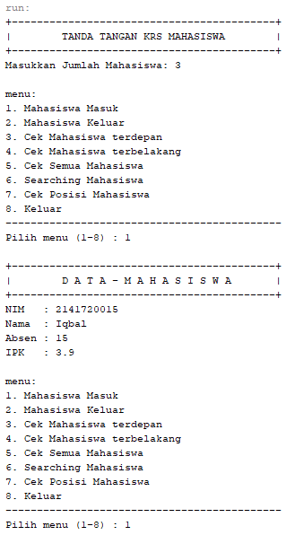 

        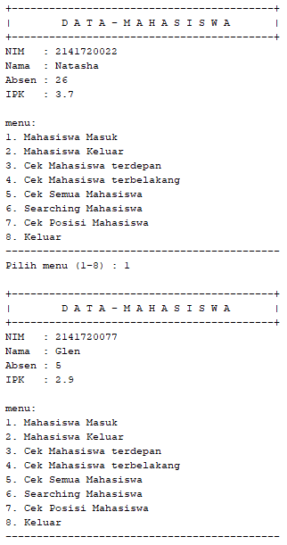 

        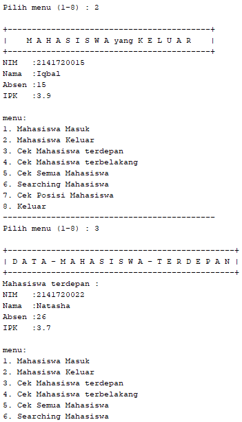 

        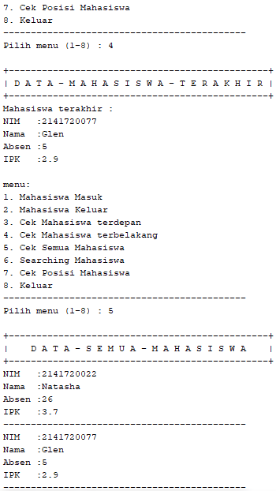 

        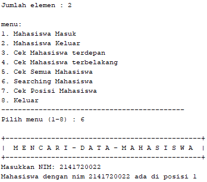 

        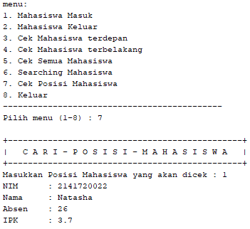 

        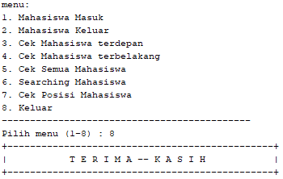 


