# Laporan Pratikum 11
Syahla' Syafiqah Fayra - TI 1F - 2141720015

## 2.1.2 Pertanyaan
1. Mengapa hasil compile kode program di baris pertama menghasilkan “Linked List Kosong”?
    
    ### Jawaban :
        Karena belum terjadinya proses penambahan, maka saat di print hasil linked list masih kosong
            
2. Pada step 10, jelaskan kegunaan kode berikut

    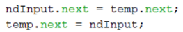

    ### Jawaban :
        Pointer node baru menyimpan alamat memori setelah key dan pointer tmp menyimpan alamat memori ndInput

3. Perhatikan class SingleLinkedList, pada method insertAt Jelaskan kegunaan kode berikut

    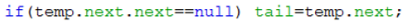

    ### Jawaban :
        Fungsi kegunaan kode ini adalah jika setelah dari setelahnya temp ini adalah null, maka tail adalah node baru

## 2.2.3 Pertanyaan
1. Mengapa digunakan keyword break pada fungsi remove? Jelaskan!

    ### Jawaban :
        Keyword break digunakan untuk menghentikan proses yang sedang berjalan

2. Jelaskan kegunaan kode dibawah pada method remove

    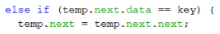

    ### Jawaban :
        Fungsi kode tersebut adalah jika pointer temp data sama dengan key atau nilai yang dicari maka pointer temp.next diganti next temp.next.next

3. Apa saja nilai kembalian yang dapat dikembalikan pada method indexOf? Jelaskan maksud masing-masing kembalian tersebut!

    ### Jawaban :
        Didalam method indexOf terdapat 2 return, yaitu jika tmp sama dengan null maka return -1 sedangkan jika tidak maka return index.

## Tugas
1. Buat method insertBefore untuk menambahkan node sebelum keyword yang diinginkan

    ### Jawaban :

    - kode program method insertBefore

        ``` java
        public void insertBefore(int key, int input){
                node ndInput = new node(input, null);
                node temp = head;
                node prev = null;
                
                do{  
                    if(head.data == key){ 
                        addFirst(input); 
                        break; 
                    } 
                    else if(temp.data == key){ 
                        ndInput.next = temp; 
                        prev.next = ndInput; 
                        if(temp.next==null){ 
                            tail = ndInput; 
                        break; 
                        } 
                    } 
                    prev = temp; 
                    temp = temp.next; 
                } while (temp != null); 
            }
        ```
    - Kode program pada SLLMain

        ``` java
        singLL.insertBefore(760, 500);
        ```

    - Hasil Run

        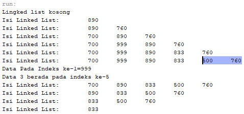


2. Implementasikan ilustrasi Linked List Berikut. Gunakan 4 macam penambahan data yang telah dipelajari sebelumnya untuk menginputkan data.

    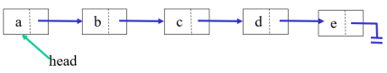

    ### Jawaban :  
    - Kode Program node

        ``` java
        public class node {
            String data;
            node next;
            
            public node( String nilai, node berikutnya){
                this.data=nilai;
                this.next=berikutnya;
            }
        }
        ```

    - Kode Program linkedlist

        ``` java
        public class sLinkedList {
            node head; // posisi awal linked list
            node tail; // posisi akhir linked list
            
            public boolean isEmpty() {
                return head == null;
            }
            
            public void print(){
                if(!isEmpty()){
                    node tmp = head;
                    System.out.println("Isi Linked List: ");
                    while (tmp != null){
                        System.out.print(tmp.data + "\t");
                        tmp = tmp.next;
                    }
                    System.out.println("");
                } else {
                    System.out.println("Lingked list kosong");
                }
            }
            
            public void addFirst(String input) {
                node ndInput = new node(input,null);
                if (isEmpty()){ // jika linked list kosong
                    head = ndInput; // head dan tail sama dengan node input
                    tail = ndInput;
                } else {
                    ndInput.next = head;
                    head = ndInput;
                }
            }
            
            public void addLast(String input){
                node ndInput = new node(input, null);
                if(isEmpty()){
                    head = ndInput; // head dan tail sama dengan node input
                    tail = ndInput;
                } else {
                    tail.next = ndInput;
                    tail = ndInput;
                }
            }
            
            public void insertAfter(String key, String input){
                node ndInput = new node(input, null);
                node temp = head;
                do{
                    if(temp.data == key){
                        ndInput.next = temp.next;
                        temp.next = ndInput;
                        if(ndInput.next==null) tail = ndInput;
                        break;
                    }
                    temp = temp.next;
                } while (temp != null);
            }
            
            public void insertAt(int index, String input){
                if(index < 0){
                    System.out.println("Indeks Salah");
                } else if (index == 0){
                    addFirst(input);
                } else {
                    node temp = head;
                    for (int i = 0; i < index-1; i++){
                        temp = temp.next;
                    }
                    temp.next = new node(input, temp.next);
                    if(temp.next.next==null) tail = temp.next;
                }
            }
        }
        ```

    - Kode Program Main

        ``` java
        public static void main(String[] args){
                
                sLinkedList sl = new sLinkedList();
                
                System.out.println("+----------------------------------+");
                System.out.println("|            LINKED LIST           |");
                System.out.println("+----------------------------------+");
                
                sl.addFirst("a");
                sl.addLast("e");
                sl.insertAfter("a", "b");
                sl.insertAt(2, "c");
                sl.insertAt(3, "d");
                sl.print();
                
            }
        ```

    - Hasil Run

        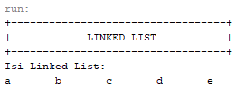

3. Buatlah Implementasi Stack berikut menggunakan Single Linked List

    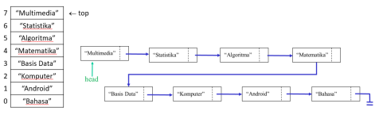

    ### Jawaban :
    - kode Program node

        ``` java
        public class node {
            String data;
            node next;
            
            public node( String nilai, node berikutnya){
                this.data=nilai;
                this.next=berikutnya;
            }
        }
        ```
    
    - Kode program linked list

        ``` java
        public class linkedList {
            node head; // posisi awal linked list
            node tail; // posisi akhir linked list
            
            public boolean isEmpty() {
                return head == null;
            }
            
            public void print(){
                if(!isEmpty()){
                    node tmp = head;
                    System.out.println("List Mata Kuliah: ");
                    System.out.println("");
                    while (tmp != null){
                        System.out.println(tmp.data);
                        tmp = tmp.next;
                    }
                    System.out.println("");
                } else {
                    System.out.println("Lingked list kosong");
                }
            }
            
            public void top(String input) {
                node ndInput = new node(input,null);
                if (isEmpty()){ // jika linked list kosong
                    head = ndInput; // head dan tail sama dengan node input
                    tail = ndInput;
                } else {
                    ndInput.next = head;
                    head = ndInput;
                }
            }
            
            public void addLast(String input){
                node ndInput = new node(input, null);
                if(isEmpty()){
                    head = ndInput; // head dan tail sama dengan node input
                    tail = ndInput;
                } else {
                    tail.next = ndInput;
                    tail = ndInput;
                }
            }
            
            public void insertAfter(String key, String input){
                node ndInput = new node(input, null);
                node temp = head;
                do{
                    if(temp.data == key){
                        ndInput.next = temp.next;
                        temp.next = ndInput;
                        if(ndInput.next==null) tail = ndInput;
                        break;
                    }
                    temp = temp.next;
                } while (temp != null);
            }
            
            public void insertBefore(String key, String input){
                node ndInput = new node(input, null);
                node temp = head;
                while(temp != null){
                    if((temp.data == key) && (temp == head)){
                        this.top(input);
                        break;
                    } else if(temp.next.data == key){
                        ndInput.next = temp.next;
                        temp.next = ndInput;
                        break;
                    }
                    temp = temp.next;
                }
            }
            
            public void insertAt(int index, String input){
                if(index < 0){
                    System.out.println("Indeks Salah");
                } else if (index == 0){
                    top(input);
                } else {
                    node temp = head;
                    for (int i = 0; i < index-1; i++){
                        temp = temp.next;
                    }
                    temp.next = new node(input, temp.next);
                    if(temp.next.next==null) tail = temp.next;
                }
            }
        }
        ```

    - kode program main

        ``` java
        public static void main(String[] args){
                
                linkedList ls = new linkedList();
                
                System.out.println("+----------------------------------+");
                System.out.println("|      LINKED LIST MATAKULIAH      |");
                System.out.println("+----------------------------------+");
                
                ls.top("Algoritma");
                ls.addLast("Bahasa");
                ls.insertAt(0, "Multimedia");
                ls.insertAfter("Multimedia", "Statistika");
                ls.insertAt(3, "Matematika");
                ls.insertBefore("Bahasa", "Android");
                ls.insertAt(4, "Basis Data");
                ls.insertAfter("Basis Data", "Komputer");
                ls.print();
                
            }
        ```

    - Hasil Run

        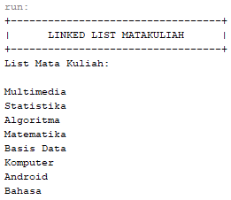

4. Buatlah implementasi program antrian untuk mengilustasikan mahasiswa yang sedang meminta tanda tangan KRS pada dosen DPA di kampus pada tugas jobsheet 8 menggunakan LinkedList. Implementasikan Queue pada antrian mahasiswa dengan menggunakan konsep LinkedList!

    ### Jawaban :
    - kode program mahasiswa

        ``` java
        public class mahasiswa {
            int nim;
            String nama;
            int absen;
            double ipk;
            
            public mahasiswa(int nim, String nama, int absen, double ipk) {
                this.nim = nim;
                this.nama = nama;
                this.absen = absen;
                this.ipk = ipk;
            }
        }
        ```

    - kode program node

        ``` java
        public class node {
            mahasiswa data;
            node next;
            
            public node(mahasiswa data, node next) {
                this.data = data;
                this.next = next;
            }
        }
        ```

    - Kode program linked list

        ``` java
        public class singleLinkedList {
            node head;
            node tail;
            
            public boolean isEmpty() {
                return head == null;
            }
            
            public void print() {
                if (!isEmpty()) {
                    node tmp = head;
                    System.out.print("Isi Linked List: ");
                    int counter = 1;
                    while (tmp != null) {
                        System.out.println("Antrian ke-" + counter + " : " + tmp.data.nim + " " +
                        tmp.data.nama + " " + tmp.data.absen + " " + tmp.data.ipk);
                        tmp = tmp.next;
                        counter++;
                    }
                } else {
                    System.out.println("Linked list kosong");
                }
            }
            
            public void peek() {
                System.out.println("Antrian terdepan : " + head.data.nim + " " + head.data.nama + " " +
                head.data.absen + " " + head.data.ipk);
            }
            
            public void peekRear() {
                System.out.println("Antrian terakhir : " + tail.data.nim + " " + tail.data.nama + " " +
                tail.data.absen + " " + tail.data.ipk);
            }
            
            public void addLast(mahasiswa input) {
                node ndInput = new node(input, null);
                if (isEmpty()) {
                    head = ndInput;
                    tail = ndInput;
                } else {
                    tail.next = ndInput;
                    tail = ndInput;
                }
            }
            
            public mahasiswa getData(int index) {
                node tmp = head;
                for (int i = 0; i < index; i++) {
                    tmp = tmp.next;
                }
                return tmp.data;
            }
            
            public int indoxOf(int key) {
                node tmp = head;
                int index = 0;
                while (tmp.next != null && tmp.data.nim != key) {
                    tmp = tmp.next;
                    index++;
                }
                if (tmp.data.nim != key) {
                    return -1;
                } else {
                    return index;
                }
            }
            
            public void removeFirst() {
                if (isEmpty()) {
                    System.out.println("Linked List masih Kosong, tidak dapat dihapus!");
                } else if (head == tail) {
                    head = tail = null;
                } else {
                    head = head.next;
                }
            }
        }
        ```

    - kode program main

        ``` java
        public static void main(String[] args) {
                Scanner sc = new Scanner(System.in);
                
                singleLinkedList ll = new singleLinkedList();
                
                int pilihan = 0;
                do{
                    System.out.println("+----------------------------------+");
                    System.out.println("|       LINKED LIST MAHASISWA      |");
                    System.out.println("+----------------------------------+");
                    System.out.println("1. Mahasiswa masuk");
                    System.out.println("2. Mahasiswa keluar");
                    System.out.println("3. Tampilkan semua mahasiswa");
                    System.out.println("4. Tampilkan mahasiswa terdepan");
                    System.out.println("5. Tampilkan makasiswa terakhir");
                    System.out.println("6. Cari posisi mahasiswa");
                    System.out.println("7. Cek posisi mahasiswa");
                    System.out.println("8. Keluar");
                    System.out.println("------------------------------------");
                    System.out.print("Pilih menu : ");
                    pilihan = sc.nextInt();
                    sc.nextLine();
                    switch (pilihan) {
                        case 1:
                            System.out.println("+----------------------------------+");
                            System.out.println("|       PENAMBAHAN MAHASISWA       |");
                            System.out.println("+----------------------------------+");
                            System.out.println("Masukkan data mahasiswa : ");
                            System.out.print("NIM : ");
                            int nim = sc.nextInt();
                            sc.nextLine(); //Scanner safety
                            System.out.print("Nama : ");
                            String nama = sc.nextLine();
                            System.out.print("Absen : ");
                            int absen = sc.nextInt();
                            System.out.print("IPK : ");
                            double ipk = sc.nextDouble();
                            ll.addLast(new mahasiswa(nim, nama, absen, ipk));
                            break;
                        case 2:
                            System.out.println("+----------------------------------+");
                            System.out.println("|      PENGURANGAN MAHASISWA       |");
                            System.out.println("+----------------------------------+");
                            ll.removeFirst();
                            break;
                        case 3:
                            System.out.println("+----------------------------------+");
                            System.out.println("|   DATA SEMUA MAHASISWA YANG ADA  |");
                            System.out.println("+----------------------------------+");
                            ll.print();
                            break;
                        case 4:
                            System.out.println("+----------------------------------+");
                            System.out.println("|        MAHASISWA TERDEPAN        |");
                            System.out.println("+----------------------------------+");
                            ll.peek();
                            break;
                        case 5:
                            System.out.println("+----------------------------------+");
                            System.out.println("|      MAHASISWA TERBELAKANG       |");
                            System.out.println("+----------------------------------+");                    
                            ll.peekRear();
                            break;
                        case 6:
                            System.out.println("+----------------------------------+");
                            System.out.println("|       PENCARIAN MAHASISWA        |");
                            System.out.println("+----------------------------------+");
                            System.out.print("Masukkan NIM : ");
                            int indexFound = ll.indoxOf(sc.nextInt());
                            System.out.println("Mahasiswa yang dicari ada diantrian ke-" + (indexFound + 1));
                            break;
                        case 7:
                            System.out.println("+----------------------------------+");
                            System.out.println("|       CARI ANTRI MAHASISWA       |");
                            System.out.println("+----------------------------------+");
                            System.out.print("Masukkan nomor antrian Mahasiswa : ");
                            mahasiswa mahasiswaFound = ll.getData((sc.nextInt() - 1));
                            System.out.println("Nomor antrian tersebut diisi oleh : " +
                            mahasiswaFound.nim + " " + mahasiswaFound.nama + " " + mahasiswaFound.absen);
                            break;
                        case 8:
                            System.out.println("+----------------------------------+");
                            System.out.println("|         PROGRAM SELESAI          |");
                            System.out.println("+----------------------------------+");
                            System.out.println("Terima kasih telah menggunakan program ini");
                            break;
                        default:
                            System.out.println("Pilihan tidak ada");
                            break;
                    }
                } while (pilihan != 0);
                sc.close();
            }
        ```

    - Hasil Run

        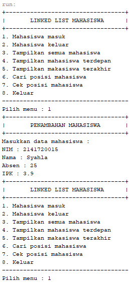

        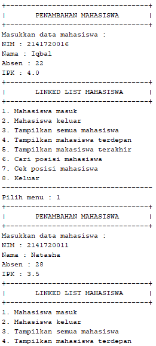

        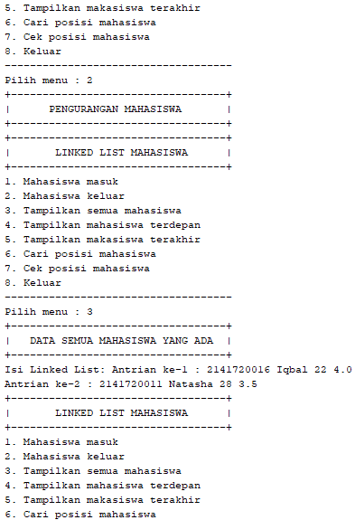

        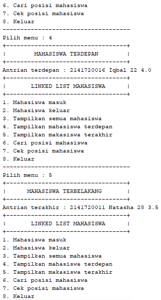

        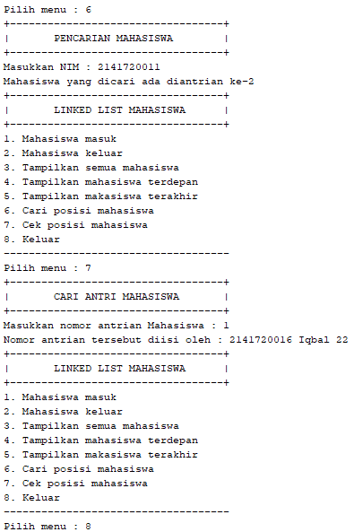

        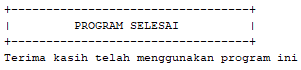
