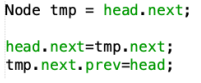

# Laporan Pratikum 12
Syahla' Syafiqah Fayra - TI 1F - 2141720015

## 12.2.3 Pertanyaan Percobaan
1. Jelaskan perbedaan antara single linked list dengan double linked lists!
    
    ### Jawaban :
        Perbedaan antara single linked list dengan double linked list terletak pada pointernya, pada single linked list pointer hanya 1 pointer yaitu next, sedangkan pada double linked list terdapat 2 pointer yaitu pointer next dan pointer previsious/prev.
            
2. Perhatikan class Node, didalamnya terdapat atribut next dan prev. Untuk apakah atribut tersebut?

    ### Jawaban :
        Atribut next berfungsi untuk menunjuk pada node setelahnya sedangkan atribut prev berfungsi untuk menunjuk pada node sebelumnya

3. Perhatikan konstruktor pada class DoubleLinkedLists. Apa kegunaan inisialisasi atribut head dan size seperti pada gambar berikut ini?

    

    ### Jawaban :
        Pada class doubleLinkedList merupakan kondisi awal dari program tersebut. Fungsi insialisasi dari atribut head == null adalah untuk menunjukan kalau head belum menyimpan pada node, sedangkan atribut size = 0 adalah memberitahukan jika jumlah data pada linked list
    
4.  Pada method addFirst(), kenapa dalam pembuatan object dari konstruktor class Node prev dianggap sama dengan null?

    

    ### Jawaban :
        Karena pada method addFirst() digunakan untuk penambah data diawal atau pada index ke 0, yang dimana data yang masuk ke node baru node prev nya bernilai null karena tidak menunjuk atau menyimpan nilai dari node manapun

5.  Perhatikan pada method addFirst(). Apakah arti statement head.prev = newNode ?

    ### Jawaban :
        Arti dari kode program head.prev = newNode adalah pointer prev pada data yang sudah ada sebelumnya akan menyimpan / menunjuk ke node yang baru

6.  Perhatikan isi method addLast(), apa arti dari pembuatan object Node dengan mengisikan parameter prev dengan current, dan next dengan null?

    

    ### Jawaban :
        Pada method addLast terdapat parameter prev dengan current yang memiliki arti yaitu current akan menyimpan node yang sebelumnya, dimana jika terjadi proses penambahan data pada index terakhir sedangkan pada next diisi dengan null karena tidak menunjuk pada node manapun karena sudah berada diakhir

## 12.3.3 Pertanyaan Percobaan
1. Apakah maksud statement berikut pada method removeFirst()?

    

    ### Jawaban :
        Maksud dari method removeFirst adalah jika dilakukan proses penghapusan pada index pertama maka nilai head akan berubah menjadi nilai head setelahnya dan nilai head.prev akan menjadi null karena tidak menyimpan atau menunjuk node manapun

2. Bagaimana cara mendeteksi posisi data ada pada bagian akhir pada method removeLast()?

    ### Jawaban :
        Yaitu dengan cara mencari posisi mana yang pointer next bernilai null. jika sudah ketemu maka sudah bisa dipastikan jika data tersebut berada pada index terakhir

3. Jelaskan alasan potongan kode program di bawah ini tidak cocok untuk perintah remove!

    

    ### Jawaban :
        Kode Program tersebut tidak cocok karena potongan kode tersebut berfungsi untuk method removeFirst yang dimana node menyimpan data setelah head dan head.next menyimpan data tmp.next, Kemudian pointer prev pada tmp.next menunjuk head sehingga kode program itu tidak cocok digunakan pada method remove

4.  Jelaskan fungsi kode program berikut ini pada fungsi remove!

    

    ### Jawaban :
        Fungsi kode program itu adalah nilai yang tadinya ada pada current.prev.prev (pointer next pada node sebelumnya) akan dipindah pada current.next sedangkan current.next.prev (pointer prev pada node selanjutnya) akan dipindah pada current.prev

## 12.4.3 Pertanyaan Percobaan
1.  Jelaskan method size() pada class DoubleLinkedLists!

    ### Jawaban :
        Method size akan mereturn nilsi menjadi 0 jika dalam kondisi tidak ada data / kosong

2. Jelaskan cara mengatur indeks pada double linked lists supaya dapat dimulai dari indeks ke 1!

    ### Jawaban :
        Yaitu dengan cara melakukan perulangan yang dimana diinisialisasikan dengan index sama dengan 1

3. Jelaskan perbedaan karakteristik fungsi Add pada Double Linked Lists dan Single Linked Lists! 

    ### Jawaban :
        Perbedaan nya adalah pada fungsi add pada double linked list hanya ada 1 fungsi yang berdasarkan indeks sisanya dapat ditambah dari awal atau akhir indeks sedangkan fungsi add pada single lingked list terdapat 3 fungsi yaitu insertAfter, insertBefore, dan insertAt

4.  Jelaskan perbedaan logika dari kedua kode program di bawah ini!

    

    ### Jawaban :
        Pada gambar a terdapat if else yang dimana jika size = 0 maka true sedangkan jika tidak maka false. Pada gambar b tidak menggunakan if else hanya langsung apakah head bernilai null jika benar maka kondisi nya adalah true

## 12.5 Tugas Praktikum
1. Buat program antrian vaksinasi menggunakan queue berbasis double linked list sesuai ilustrasi dan menu di bawah ini! (counter jumlah antrian tersisa di menu cetak(3) dan data orang yang telah divaksinasi di menu Hapus Data(2) harus ada) 
   
    ## Ilustrasi Program

    - 
             
    - 

    ### Jawaban :
    - Kode Program
        1. node

            ``` java
            public class node {
                
                String nama;
                int nomor;
                node prev, next;
                
                node(node prev, int nomor, String nama, node next){
                    this.prev = prev;
                    this.nomor = nomor;
                    this.nama = nama;
                    this.next = next;
                }
            }
            ```

        2. doubleLinkedList

            ``` java
            public class dLinkedList {
                
                node front, rear;
                int size;
                
                public dLinkedList() {
                    front = null;
                    rear = null;
                    size = 0;
                }
                
                public boolean isEmpty() {
                    return front == null;
                }
                public void enqueue(int nomor, String nama){
                    node nodeS = new node(null, nomor, nama, null);
                    if(isEmpty()){ 
                        front = nodeS;
                        rear = nodeS;
                    } else { 
                        rear.next = nodeS;
                        rear = nodeS;
                    }
                    size++; 
                }
                
                public void dequeue() throws Exception {
                if(isEmpty()) {
                    throw new Exception("Linked List masih kosong, tidak dapat dihapus");
                } else if (size == 1){ // jika size = 1
                    removeLast(); // maka masuk ke method removeLast
                } else {
                    System.out.println(front.nama + " telah selesai divaksinasi");
                    front = front.next;
                    front.prev = null;
                    size--;
                }
                }
                
                public void removeLast() throws Exception {
                if(isEmpty()) {
                    throw new Exception("Linked List masih kosong, tidak dapat dihapus");
                } else if (front.next == null ) { 
                    front = null; 
                    size--;
                    return;
                }
                node current = front; 
                while (current.next.next != null){
                    current = current.next;
                }
                current.next = null;
                size--;
                }
                
                public void print() {
                    if (!isEmpty()) {
                        node temp = front;
                        System.out.println("+--------------------------------+");
                        System.out.println("|     Daftar Pengantri vaksin    |");
                        System.out.println("+--------------------------------+");
                        System.out.println("| Nomor\t | Nama\t |");
                        while (temp != null) {
                            System.out.println("| " + temp.nomor + " \t | " + temp.nama + "\t |");
                            temp = temp.next;
                        }
                        System.out.println("Sisa Antrian : " + size);
                        System.out.println("");
                    } else {
                        System.out.println("Linked List Kosong");
                    }
                }
            }
            ```

        3. Main

            ``` java
            public class main {
                
                public static void menu() {
                    System.out.println("+--------------------------------+");
                    System.out.println("|  PENGANTRI VAKSIN EXTRAVAGANZA |");
                    System.out.println("+--------------------------------+");
                    System.out.println("| 1. Tambah Data Penerima Vaksin |");
                    System.out.println("| 2. Hapus Data Pengantri Vaksin |");
                    System.out.println("| 3. Daftar Penerima Vaksin      |");
                    System.out.println("| 4. Keluar                      |");
                    System.out.println("+--------------------------------+");
                }
                
                public static void main (String[] args) throws Exception {
                    Scanner sc = new Scanner(System.in);
                    Scanner scS = new Scanner(System.in);
                    int menu = 0;
                    
                    dLinkedList s = new dLinkedList();
                    
                    while (menu != 4){
                        menu();
                        System.out.print("| Pilih Menu : "); 
                        menu = sc.nextInt();
                        System.out.println("+--------------------------------+");
                        try {
                            switch(menu) {
                                case 1:
                                    System.out.println("");
                                    System.out.println("+--------------------------------+");
                                    System.out.println("|  Masukkan Data Penerima Vaksin |");
                                    System.out.println("+--------------------------------+");
                                    System.out.print("Nomor Antrian: ");
                                    int no = sc.nextInt();
                                    System.out.print("Nama Penerima: ");
                                    String nama = scS.nextLine();
                                    s.enqueue(no, nama);
                                    System.out.println("----------------------------------");
                                    break;
                                case 2:
                                    s.dequeue();
                                    s.print();
                                    break;
                                case 3:
                                    System.out.println("");
                                    s.print();
                                    break;
                                case 4:
                                    System.out.println("+--------------------------------+");
                                    System.out.println("|  PROGRAM SELESAI DIJALANKAN    |");
                                    System.out.println("+--------------------------------+");
                                    break;

                                default:
                                    System.out.println("Pilihan Tidak ada");
                                    break;
                            }
                            System.out.println("");
                        } catch (Exception e){
                            
                        }
                    }
                }
            }
            ```
    - Hasil Running
        1. Tambah Data

            - 
            - 

        2. Hapus Data 

            

        3. Semua Data

            

        4. Keluar
            
            

2. Buatlah program daftar film yang terdiri dari id, judul dan rating menggunakan double linked lists, bentuk program memiliki fitur pencarian melalui ID Film dan pengurutan Rating secara descending. Class Film wajib diimplementasikan dalam soal ini.

    ## Contoh Ilustrasi Program

    -  

    -  
    -  

    ### Jawaban :  
    - Kode Program
        1. node

            ``` java
            public class node {
                
                int id;
                String judul;
                double rating;
                node prev, next;
                
                node(node prev, int id, String judul, double rating, node next){
                    this.prev = prev;
                    this.id = id;
                    this.judul = judul;
                    this.rating = rating;
                    this.next = next;
                }
            }
            ```

        2. doubleLinkedList

            ``` java
            public class dLinkedList {
                node front, rear;
                int size;
                
                public dLinkedList() {
                    front = null;
                    rear = null;
                    size = 0;
                }
                
                public boolean isEmpty() {
                    return front == null;
                }
                
                public void addFirst(int id, String judul, double rating){
                    if(isEmpty()){
                        front = new node(null, id, judul, rating, null); 
                    } else { 
                        node newNode = new node (null, id, judul, rating, front);
                        front.prev = newNode; 
                        front = newNode; 
                    }
                    size++; 
                }
                
                public void addLast(int id, String judul, double rating){
                    if(isEmpty()) {
                        addFirst(id, judul, rating);
                    } else { 
                        node current = front; // current = duplikat node
                        while (current.next != null){ // jika posisinya setelahnya tidak kosong
                            current = current.next; // maka masuk ke posisi setelahnya
                        }
                        node newNode = new node(current, id, judul, rating, null);
                        current.next = newNode; 
                    }
                    size++; // bertambah size
                }
                
                public void add(int id, String judul, double rating, int index) throws Exception{
                    if(isEmpty()){
                        addFirst(id, judul, rating);
                    } else if (index < 0 || index > size){
                        throw new Exception("Nilai Index diluar batas");
                    } else {
                        node current = front;
                        int i = 0;
                        while (i < index){ 
                            current = current.next;
                            i++;
                        }
                        if (current.prev == null){ 
                            node newNode = new node(null, id, judul, rating, current); 
                            current.prev = newNode; 
                            front = newNode;
                        } else { // jika index > 0
                            node newNode = new node(current.prev, id, judul, rating, current);
                            // proses perubahan
                            newNode.prev = current.prev;
                            newNode.next = current;
                            current.prev.next = newNode;
                            current.prev = newNode;
                        }
                    }
                    size++;
                }
                
                public void removeFirst() throws Exception {
                if(isEmpty()) {
                    throw new Exception("Linked List masih kosong, tidak dapat dihapus");
                } else if (size == 1){
                    removeLast();
                } else {
                    front = front.next; 
                    front.prev = null; 
                    size--; 
                    return;
                }
                node current = front;
                while (current.next.next != null){
                    current = current.next;
                }
                current.next = null;
                size--;
                }
                
                public void removeLast() throws Exception {
                    if(isEmpty()) {
                        throw new Exception("Linked List masih kosong, tidak dapat dihapus");
                    } else if (front.next == null ) { 
                        front = null; 
                        size--;
                        return;
                    }
                    node current = front;
                    while (current.next.next != null){
                        current = current.next;
                    }
                    current.next = null;
                    size--;
                }
                
                public void remove(int index) throws Exception {
                    if(isEmpty()) {
                        throw new Exception("Nilai Index diluar batas");
                    } else if (index == 0){
                        removeFirst(); 
                    } else {
                        node current = front;
                        int i = 0; 
                        while (i< index){ 
                            current = current.next;
                            i++;
                        }
                        if(current.next == null){
                            current.prev.prev = null;
                        } else if (current.prev == null){
                            current = current.next;
                            current.prev = null; 
                            front = current;
                        } else {
                            current.prev.next = current.next; 
                            current.next.prev = current.prev;
                        }
                        size--;
                    }
                }
                
                public int search(int cari){
                    if(isEmpty()){
                        System.out.println("Linked list masih kosong");
                    } 
                    node tmp = front;
                    int posisi = -1;
                    int index = 0;
                    while (tmp != null){
                        if(tmp.id == cari){
                            posisi = index;
                        }
                        index++;
                        tmp = tmp.next;
                    }
                    return posisi;
                }
                
                public void tampilPosisi (int x, int pos){ // x = nilainya, pos = posisi
                    if (pos != -1){  
                        System.out.println("ID " + x + " Ditemukan pada indeks ke - " + (pos));
                    } else {
                        System.out.println("ID " + x + " Tidak Ditemukan");
                    }
                }
                
                
                public void tampilData(int x, int pos){
                    if (pos!= -1){ // jika datanya ditemukan
                        System.out.println("ID\t: " + x);
                        System.out.println("Judul\t: " + front.judul);
                        System.out.println("Rating\t: " + front.rating);
                    } else {
                        System.out.println("ID " + x + " Tidak Ditemukan");
                    }
                }
                
                public void sort(){
                    node current = front, index = null;
                    double temp;
                    
                if (isEmpty()){
                    System.out.println("Linked List Kosong");
                } else {
                    while (current != null){
                        index = current.next;
                        while(index != null) {
                            if(current.rating < index.rating){
                                temp = current.rating;
                                current.rating = index.rating;
                                index.rating = temp;
                            }
                            index = index.next;
                        }
                        current = current.next;
                    }
                }
                }
                
                public void print(){
                    if (!isEmpty()) {
                        node temp = front;
                        System.out.println("| ID\t | Judul\t | Rating |");
                        while (temp != null) {
                            System.out.println("| " + temp.id + " \t | " + temp.judul + " \t | " + temp.rating + " \t  |");
                            temp = temp.next;
                        }
                        System.out.println("");
                    } else {
                        System.out.println("Linked List Kosong");
                    }
                }
            }
            ```

        3. Main

            ``` java
            public class main {
                public static void menu() {
                    System.out.println("+--------------------------------+");
                    System.out.println("|     DAFTAR FILM LAYAR LEBAR    |");
                    System.out.println("+--------------------------------+");
                    System.out.println("| 1. Tambah Data Awal            |");
                    System.out.println("| 2. Tambah Data Akhir           |");
                    System.out.println("| 3. Tambah Data Index tertentu  |");
                    System.out.println("| 4. Hapus Data Pertama          |");
                    System.out.println("| 5. Hapus Data Terakhir         |");
                    System.out.println("| 6. Hapus Data Tertentu         |");
                    System.out.println("| 7. Cetak Semua Film            |");
                    System.out.println("| 8. Cari ID Film Layar Lebar    |");
                    System.out.println("| 9. Urut Rating Film - DESC     |");
                    System.out.println("| 10. Keluar                     |");
                    System.out.println("+--------------------------------+");
                }
                
                public static void input() {
                    Scanner sc = new Scanner(System.in);
                    Scanner scS = new Scanner(System.in);
                    
                    System.out.print("ID     : ");
                    int id = sc.nextInt();
                    System.out.print("Judul  : ");
                    String judul = scS.nextLine();
                    System.out.print("Rating : ");
                    double rating = sc.nextDouble();
                }
                
                public static void main (String[] args) throws Exception {
                    Scanner sc = new Scanner(System.in);
                    Scanner scS = new Scanner(System.in);
                    int menu = 0;
                    
                    dLinkedList s = new dLinkedList();
                    
                    while (menu != 10){
                        menu();
                        System.out.print("| Pilih Menu : "); 
                        menu = sc.nextInt();
                        System.out.println("+--------------------------------+");
                        try {
                            switch(menu) {
                                case 1:
                                    System.out.println("");
                                    System.out.println("+--------------------------------+");
                                    System.out.println("|    Masukkan Data Film - Awal   |");
                                    System.out.println("+--------------------------------+");
                                    System.out.print("ID     : ");
                                    int id = sc.nextInt();
                                    System.out.print("Judul  : ");
                                    String judul = scS.nextLine();
                                    System.out.print("Rating : ");
                                    double rating = sc.nextDouble();
                                    s.addFirst(id, judul, rating);
                                    System.out.println("----------------------------------");
                                    break;
                                case 2:
                                    System.out.println("");
                                    System.out.println("+--------------------------------+");
                                    System.out.println("|   Masukkan Data Film - Akhir   |");
                                    System.out.println("+--------------------------------+");
                                    System.out.print("ID     : ");
                                    int id1 = sc.nextInt();
                                    System.out.print("Judul  : ");
                                    String judul1 = scS.nextLine();
                                    System.out.print("Rating : ");
                                    double rating1 = sc.nextDouble();
                                    s.addLast(id1, judul1, rating1);
                                    System.out.println("----------------------------------");
                                    break;
                                case 3: 
                                    System.out.println("");
                                    System.out.println("+--------------------------------+");
                                    System.out.println("|   Masukkan Data Film - Index   |");
                                    System.out.println("+--------------------------------+");
                                    System.out.print("Index ke- : ");
                                    int idx = sc.nextInt();
                                    System.out.print("ID     : ");
                                    int id2 = sc.nextInt();
                                    System.out.print("Judul  : ");
                                    String judul2 = scS.nextLine();
                                    System.out.print("Rating : ");
                                    double rating2 = sc.nextDouble();
                                    s.add(id2, judul2, rating2, idx);
                                    System.out.println("----------------------------------");
                                    break;
                                case 4:
                                    System.out.println("");
                                    System.out.println("+--------------------------------+");
                                    System.out.println("|     Hapus Data Film - Awal     |");
                                    System.out.println("+--------------------------------+");
                                    s.removeFirst();
                                    s.print();
                                    break; 
                                
                                case 5:
                                    System.out.println("");
                                    System.out.println("+--------------------------------+");
                                    System.out.println("|     Hapus Data Film - Akhir    |");
                                    System.out.println("+--------------------------------+");
                                    s.removeLast();
                                    s.print();
                                    break;    
                                
                                case 6:
                                    System.out.println("");
                                    System.out.println("+--------------------------------+");
                                    System.out.println("|     Hapus Data Film - Index    |");
                                    System.out.println("+--------------------------------+");
                                    System.out.print("Index ke - : ");
                                    int d = sc.nextInt();
                                    s.remove(d);
                                    s.print();
                                    System.out.println("----------------------------------");
                                    break;
                                    
                                case 7:
                                    System.out.println("");
                                    System.out.println("+---------------------------------+");
                                    System.out.println("|   SEMUA DATA FILM LAYAR LEBAR   |");
                                    System.out.println("+---------------------------------+");
                                    s.print();
                                    break;
                                    
                                case 8:
                                    System.out.println("");
                                    System.out.println("+--------------------------------+");
                                    System.out.println("|      Cari Film Layar Lebar     |");
                                    System.out.println("+--------------------------------+");
                                    System.out.print("Masukkan ID film : ");
                                    int cari = sc.nextInt();
                                    int idFilm = s.search(cari);
                                    s.search(cari);
                                    s.tampilData(cari, idFilm);
                                    s.tampilPosisi(cari, idFilm);
                                    System.out.println("----------------------------------");
                                    break;
                                
                                case 9:
                                    System.out.println("");
                                    System.out.println("+--------------------------------+");
                                    System.out.println("|     Urut Rating Film - DESC    |");
                                    System.out.println("+--------------------------------+");
                                    s.sort();
                                    s.print();
                                    break;    
                            
                                case 10:
                                    System.out.println("+--------------------------------+");
                                    System.out.println("|  PROGRAM SELESAI DIJALANKAN    |");
                                    System.out.println("+--------------------------------+");
                                    break;   
                                    
                                default:
                                    System.out.println("Pilihan Tidak ada");
                                    break;
                            }
                            System.out.println("");
                        } catch (Exception e){
                            
                        }
                    }
                }
            }
            ```

    - Hasil Running
        1. Tambah Data Awal

            
        
        2. Tambah Data Akhir

            

        3. Tambah Data index tertentu

            

        4. Cetak Semua film

            

        5. Pencarian ID film

            

        6. Pengurutan rating film (DESC)

            

        7. Hapus Data Pertama

            

        8. Hapus Data Terakhir

            

        9. Hapus Index Tertentu

            

        10. Keluar Program

            
        
