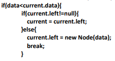
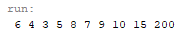
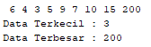
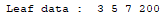
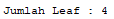
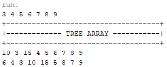

# Laporan Pratikum 13
Syahla' Syafiqah Fayra - TI 1F - 2141720015

## 2.1.2 Pertanyaan Percobaan
1. Mengapa dalam binary search tree proses pencarian data bisa lebih efektif dilakukan dibanding binary tree biasa?
    
    ### Jawaban : 
        Karena hanya ada 2 langkah untuk melakukan proses search yaitu mencari dengan menggunakan node nilai lebih kecil dan node nilai lebih besar dengan begitu mudah untuk melakukan proses search 
            
2. Untuk apakah di class Node, kegunaan dari atribut left dan right?

    ### Jawaban :
        Kegunaan nya adalah untuk menghubungkan node satu dengan yang lain dan untuk menyimpan data

3. a. Untuk apakah kegunaan dari atribut root di dalam class BinaryTree? b. Ketika objek tree pertama kali dibuat, apakah nilai dari root?

    ### Jawaban :
        a. Untuk memberi tanda tada sebagai current
        b. nilai root saat pertama kali dibuat adalah null
    
4.  Ketika tree masih kosong, dan akan ditambahkan sebuah node baru, proses apa yang akan terjadi?

    ### Jawaban :
        Sebelum terjadinya proses penambahan data dilakukan pengecekan apakah ada isi atau masih kosong, jika kosong maka data yang ditambahkan akan menjadi node current dan berfungsi juga sebagai root

5.  Perhatikan method add(), di dalamnya terdapat baris program seperti di bawah ini. Jelaskan secara detil untuk apa baris program tersebut?

    

    ### Jawaban :
        Pertama kali dilakukan proses pengecekan apakah data kurang dari current.data, setelah itu jika true atau benar makan akan dilakukan pengecekan lagi untuk atribut left apakah tidak sama dengan null, jika tidak maka data akan menjadi left


## 13.2.1 Pertanyaan Percobaan
1. Apakah kegunaan dari atribut data dan idxLast yang ada di class BinaryTreeArray?

    ### Jawaban :
        Kegunaan dari atrbut data adalah untuk menyimpan data ke array, sedangkan idxlast untuk menentukan nilai yang ada pada array tersebut

2. Apakah kegunaan dari method populateData()?

    ### Jawaban :
        Kegunaan dari method populateData adalah menunjukkan data pada idxLast

3. Apakah kegunaan dari method traverseInOrder()?

    ### Jawaban :
        Kegunaan dari method traverseInOrder adalah untuk menentukan root awal
    
4.  Jika suatu node binary tree disimpan dalam array indeks 2, maka di indeks berapakah posisi left child dan rigth child masin-masing?

    ### Jawaban :
        Untuk posisi left chld berada pada indeks ke - 1 sedangkan right child berada pada indeks ke - 2

5.  Apa kegunaan statement int idxLast = 6 pada praktikum 2 percobaan nomor 4?

    ### Jawaban :   
        Kegunaan nya adalah untuk membuat indeks terakhir di array ke 6

## 13.3 Tugas Praktikum
1. Buat method di dalam class BinaryTree yang akan menambahkan node dengan cara rekursif.

    ### Jawaban :
    - Kode Program
        ``` java
        void insertRec(int key){
                root = insertRec(root, key);
            }
            
            //Fungsi Rekursif untuk memasukkan Node
            node insertRec(node root, int key){
                if(root == null){
                    root = new node(key);
                    return root;
                }
                
                //Untuk menaruh leaf apakah di kiri atau kanan
                if(key < root.data){
                    root.left = insertRec(root.left, key);
                }else if(key > root.data){
                    root.right = insertRec(root.right, key);
                }
                return root;
            }
        ```
        
    - Hasil Running

        
       
2. Buat method di dalam class BinaryTree untuk menampilkan nilai paling kecil dan yang paling besar yang ada di dalam tree.

    ### Jawaban :  
    - Kode Program
        ``` java
        void min(){
                node current = root;
                
                while (current.left != null){
                    current = current.left;
                }
                System.out.print("" + current.data);
            }
            
            void max(){
                node current = root;
                
                while(current.right != null){
                    current = current.right;
                }
                System.out.println("" + current.data);
            }
        ```
       
    - Hasil Running

        

3. Buat method di dalam class BinaryTree untuk menampilkan data yang ada di leaf.

    ### Jawaban :  
    - Kode Program
        ``` java
        void displayleaf(node root){
                if(root == null){
                    return;
                }
                if(root.left == null && root.right == null){
                    System.out.print(" " + root.data);
                    return;
                }if(root.left != null){
                    displayleaf(root.left);
                }if(root.right != null){
                    displayleaf(root.right);
                }
            }
        ```
       
    - Hasil Running

        

4. Buat method di dalam class BinaryTree untuk menampilkan berapa jumlah leaf yang ada di dalam tree.

    ### Jawaban :  
    - Kode Program
        ``` java
        int totalleaf(){
                return totalleaf(root);
            }
            
            int totalleaf(node node){
                if(node == null){
                    return 0;
                }
                if(node.left == null && node.right == null){
                    return 1;
                }else{
                    return totalleaf(node.left) + totalleaf(node.right);
                }
            }
        ```
       
    - Hasil Running

        

5. Modifikasi class BinaryTreeArray, dan tambahkan : 
    - method add(int data) untuk memasukan data ke dalam tree 
    - method traversePreOrder() dan traversePostOrder()

    ### Jawaban :  
    - Kode Program
        ``` java
        void add(int data) {
                if (idxLast == this.data.length - 1) {
                    System.out.println("Tree is full");
                } else {
                    this.data[++idxLast] = data;
                }
            }
            
            void traversePreOrder(int idxStart) {
                if (idxStart <= idxLast) {
                    System.out.print(data[idxStart] + " ");
                    traversePreOrder(2 * idxStart + 1);
                    traversePreOrder(2 * idxStart + 2);
                }
            }
            
            void traversePostOrder(int idxStart) {
                if (idxStart <= idxLast) {
                    traversePostOrder(2 * idxStart + 1);
                    traversePostOrder(2 * idxStart + 2);
                    System.out.print(data[idxStart] + " ");
                }
            }
        ```
       
    - Hasil Running

        