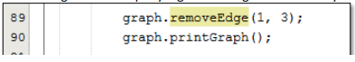
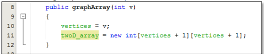
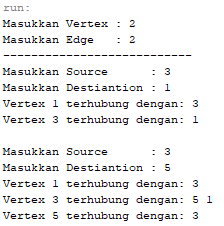
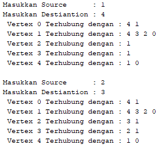
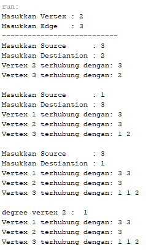
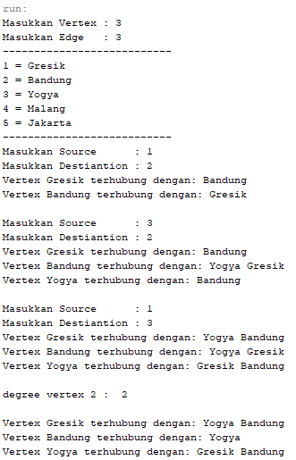

# Laporan Pratikum 15
Syahla' Syafiqah Fayra - TI 1F - 2141720015

## 2.1.3 Pertanyaan Percobaan
1. Sebutkan beberapa jenis (minimal 3) algoritma yang menggunakan dasar Graph, dan apakah kegunaan algoritma-algoritma tersebut?
    
    ### Jawaban :
        Ada banyak jenis algortima seperti algoritma Brent -> untuk menentukan adanya daur ulang dalam graph, Algoritma Prim -> Untuk menentukan minimum spanning tree, Algoritma Bouruvka -> Untuk menentukan minimum spanning tree, Algoritma warshall -> untuk menyelesaikan permasalahan jalur terpendek multi path, dan Algoritma Floyd -> untuk menentukan adanya jalur pada graf. 
            
2. Pada class Graph terdapat array bertipe LinkedList, yaitu LinkedList list[]. Apakah tujuan pembuatan variabel tersebut ? 

    ### Jawaban :
        Yaitu untuk memanggil class LinkedList yang nantinya method di class tersebut akan digunakan didalam class graph. sedangkan tujuan variabel adalah untuk mengisi vertex
        

3. Apakah alasan pemanggilan method addFirst() untuk menambahkan data, bukan method add jenis lain pada linked list ketika digunakan pada method addEdge pada class Graph?

    ### Jawaban :
        Karena akan dilakukan penambahan data yang dimulai dari awal untuk menghubungka vertex dengan koneksinya. apabila menggunakan add() harus menyesuaikan indeks bila ingin menginput nilai, sedangkan addlast hasilnya akan tidak sesuai karena input nilai dari indeks terakhir
        
    
4.  Bagaimana cara mendeteksi prev pointer pada saat akan melakukan penghapusan suatu edge pada graph ?

    ### Jawaban :
        Ketika eksekusi kode program pada baris i==destination, maka dapat dilihat source dari i tersebut

5.  Kenapa pada praktikum 2.1.1 langkah ke-12 untuk menghapus path yang bukan merupakan lintasan pertama kali menghasilkan output yang salah ? Bagaimana solusinya ?

    

    ### Jawaban :
        Output tidak error namun data vertex yang dilewati mengalami perubahan lintasan.
        

## 2.2.3 Pertanyaan Percobaan
1. Apakah perbedaan degree/derajat pada directed dan undirected graph?

    ### Jawaban :
        Pada directed graph tidak sama dan tidak selalu berhubungan kembali sedangkan pada undirected graph degree sama dan pasti berhubungan kembali
        

2. Pada implementasi graph menggunakan adjacency matriks. Kenapa jumlah vertices harus ditambahkan dengan 1 pada indeks array berikut?

    

    ### Jawaban :
        Karena menggunakan array dan dimulai dari 0, maka harus perlu ditambah dengan 1

3. Apakah kegunaan method getEdge() ?

    ### Jawaban :
        Untuk melakukan pencarian dan mengeluarkan output yang berupa keterangan apakah edge yang dicari itu ada di dalam graph 
    
4.  Termasuk jenis graph apakah uji coba pada praktikum 2.2?

    ### Jawaban :
        Yaitu jenis directed graph

5.  Mengapa pada method main harus menggunakan try-catch Exception ?

    ### Jawaban :   
        Apabila terjadi error maka  Statement tersebut digunakan untuk mengurung eksekusi yang menampilkan error dan dapat membuat program tetap berjalan tanpa dihentikan secara langsung.
        

## 3. Tugas Praktikum
1. Ubahlah lintasan pada praktikum 2.1 menjadi inputan!

    ### Jawaban :
    - Kode Program
        ``` java
        public static void main(String[] args)throws Exception {
            // tugas 1
            Scanner sc = new Scanner(System.in);
            graph g = new graph(6);
            System.out.print("Masukkan Vertex : ");
            int verte = sc.nextInt();
            
            System.out.print("Masukkan Edge   : ");
            int Tedge = sc.nextInt();
            System.out.println("---------------------------");
            for (int i = 0; i < Tedge; i++) {
                System.out.print("Masukkan Source      : ");
                int source = sc.nextInt();
                System.out.print("Masukkan Destiantion : ");
                int des = sc.nextInt();
                
                g.addEdge(source,des);
                g.printGraph();
            }
        }
        ```
        
    - Hasil Running

        - 
        - 
       
2. Tambahkan method graphType dengan tipe boolean yang akan membedakan graph termasuk directed atau undirected graph. Kemudian update seluruh method yang berelasi dengan method graphType tersebut (hanya menjalankan statement sesuai dengan jenis graph) pada praktikum 2.1

    ### Jawaban :  
    - Kode Program
        ``` java
            public boolean graphType() throws Exception{
                int a = 0, b = 0;
                for(int s=0; s<vertex;s++){
                    int k, totalIn = 0, totalOut = 0;
                    for (int i = 0; i < vertex; i++){
                        for (int j = 0; j < list[i].size(); j++){
                            if(list[i].get(j)==s)
                                ++totalIn;
                        }
                        //out degree
                    for (k=0; k<list[s].size(); k++){
                        list[s].get(k);
                    }
                    totalOut = k;
                    }
                    a = totalIn;
                    b = totalOut;
                }
                if (a == b){
                    return true;//indirect
                }else return false;
            }
        ```
       
    - Hasil Running

        

3. Modifikasi method removeEdge() pada praktikum 2.1 agar tidak menghasilkan output yang salah untuk path selain path pertama kali!

    ### Jawaban :  
    - Kode Program
        ``` java
        public void removeEdge(int source, int destination) throws Exception{
                for (int i = 0; i < vertex; i++) {
                    if (i == destination) {
                        list[source].remove(source);
                    }
                }
            }    
        ```
       
    - Hasil Running

        

4. Ubahlah tipe data vertex pada seluruh graph pada praktikum 2.1 dan 2.2 dari Integer menjadi tipe generic agar dapat menerima semua tipe data dasar Java! Misalnya setiap vertex yang awalnya berupa angka 0,1,2,3, dst. selanjutnya ubah menjadi suatu nama daerah seperti Gresik, Bandung, Yogya, Malang, dst.

    ### Jawaban :  
    - Kode Program graph
        ``` java
        public void printGraph4() throws Exception{ // tugas 4
                String kota=" ";
                for(int i = 0; i<vertex; i++){
                    if(list[i].size()>0){
                        if (i==1){
                            kota = "Gresik";
                        }else if(i==2){
                            kota = "Bandung";
                        }else if(i==3){
                            kota ="Yogya";
                        }else if(i==4){
                            kota ="Malang";
                        }else if(i==5){
                            kota = "Jakarta";
                        }
                        System.out.print("Vertex "+ kota + " terhubung dengan: ");
                    for(int j = 0; j<list[i].size(); j++){
                        if (list[i].get(j)==1){
                            kota = "Gresik";
                        }else if(list[i].get(j)==2){
                            kota = "Bandung";
                        }else if(list[i].get(j)==3){
                            kota ="Yogya";
                        }else if(list[i].get(j)==4){
                            kota ="Malang";
                        }else if(list[i].get(j)==5){
                            kota = "Jakarta";
                        }
                        System.out.print(kota+" ");
                    }
                    System.out.println("");
                    }
                }
                System.out.println(" ");
            }      
        ```
    
    - Kode Program main
        ``` java
        public static void main(String[] args)throws Exception {
            Scanner sc = new Scanner(System.in);
                graph g = new graph(6);
                System.out.print("Masukkan Vertex : ");
                int verte = sc.nextInt();
                
                System.out.print("Masukkan Edge   : ");
                int Tedge = sc.nextInt();
                System.out.println("---------------------------");
                System.out.println("1 = Gresik");
                System.out.println("2 = Bandung");
                System.out.println("3 = Yogya");
                System.out.println("4 = Malang");
                System.out.println("5 = Jakarta");
                System.out.println("---------------------------");
                
                for (int i = 0; i < Tedge; i++) {
                    System.out.print("Masukkan Source      : ");
                    int source = sc.nextInt();
                    System.out.print("Masukkan Destiantion : ");
                    int des = sc.nextInt();
                    
                    g.addEdge(source,des);
                    g.printGraph4();
                }
                g.degree(2);
                System.out.println("");

                g.removeEdge(2,1);
                g.printGraph4();
            
        }       
        ```
       
    - Hasil Running

        
