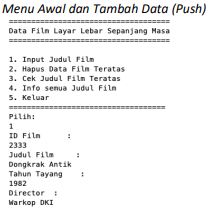

# Laporan Pratikum 16
Syahla' Syafiqah Fayra - TI 1F - 2141720015

## 16.2.3. Pertanyaan Percobaan
1. Perhatikan baris kode 25-36, mengapa semua jenis data bisa ditampung ke dalam sebuah Arraylist?
    
    ### Jawaban : 
        Karena tidak diberikan keterangan tipe data spesifik maka semua data bisa di tampung, contoh yang memiliki tipe data spesifik 

    ``` java
    list<String> i = new ArrayList();
    ```
                
2. Modifikasi baris kode 25-36 seingga data yang ditampung hanya satu jenis atau spesifik tipe tertentu! 

    ### Jawaban :
    - kode program

        ``` java
        List<Integer> l = new ArrayList(); // no 2
                l.add(1);
                l.add(2);
                l.add(3);
                l.add(4);
                System.out.printf("Elemen 0: %d, total elemen: %d, elemen terakhir: %s\n", l.get(0), l.size(), l.get(l.size() - 1));
        ```
    - Hasil Run:

        

3. Ubah kode pada baris kode 38 menjadi seperti ini

    

    ### Jawaban :

    ``` java
        LinkedList<String> names = new LinkedList<>(); // no 3
    ```
    
4.  Tambahkan juga baris berikut ini, untuk memberikan perbedaan dari tampilan yang sebelumnya

     

    ### Jawaban :

    ``` java
        names.push("Mei-mei"); // no 4
                System.out.printf("Elemen 0: %s total elemen: %s elemen terakhir: %s\n", names.get(0), names.size(), names.get(names.size() - 1));
                System.out.println("Names: " + names.toString());
    ```    

5.  Dari penambahan kode tersebut, silakan dijalankan dan apakah yang dapat Anda jelaskan!

    ### Jawaban :
        Dari hasil Run sama, namun dari kode program berbeda. jika menggunakan maka untuk menambah data menggunakan add, dan jika menggunakan linkedlist menambah datanya menggunakan push. dibawah ini merupakan hasil run.

    
        
## 16.3.3. Pertanyaan Percobaan
1. Apakah perbedaan fungsi push() dan add() pada objek fruits?

    ### Jawaban :      
        Kedua fungsi tersebut sama sama berfungsi untuk menambahkan data, tetapi fungsi push digunakan pada subinterface stack 

2. Silakan hilangkan baris 43 dan 44, apakah yang akan terjadi? Mengapa bisa demikian?

    ### Jawaban :
        Hasil run melon dan duran akan menghilang, karena kode program dihilangkan, tetapi hasil run hanya mencetak baris kosong. Hasil run bisa diliat dibawah ini.
    
    

3. Jelaskan fungsi dari baris 46-49?

    ### Jawaban :
    ``` java
        for(Iterator<String> it = fruits.iterator(); it.hasNext();){
           String fruit = it.next();
            System.out.printf("%s ", fruit);
        }
    ```

        pada baris 46 adalah untuk proses inisialisasi dan mengatur aturan perulangan, pada baris 47 adalah untuk pembuatan variabel fruit. dan pada baris 48 adalah untuk pencetakan variabel fruit
        
    
4.  Silakan ganti baris kode 25, Stack<String> menjadi List<String> dan apakah yang terjadi? Mengapa bisa demikian?
    
    ### Jawaban :
        Yang terjadi adalah error pada sebagian kode, karena method push, empty, dan pop error karena tidak bisa dijalankan pada interface list

    
       

5.  Ganti elemen terakhir dari dari objek fruits menjadi “Strawberry”!

    ### Jawaban :   
    - Kode program
        ``` java
            fruits.set(4, "Strawberry"); // no 5
        ```
    - hasil run

        

5.  Tambahkan 3 buah seperti “Mango”,”guava”, dan “avocado” kemudian dilakukan sorting!

    ### Jawaban : 
    - kode program    
        ``` java
        public static void main(String[] args) {
                
                Stack<String> fruits = new Stack<>();
                fruits.push("Banana");
                fruits.add("Orange");
                fruits.add("Watermelon");
                fruits.add("Leci");
                fruits.push("Salak");
                fruits.set(4, "Strawberry"); // no 5
                fruits.add("Mango");
                fruits.add("Guava");
                fruits.add("Avocado");
                System.out.println("+-----------------------------------------------------------+");
                System.out.println("|                     Sebelum Diurutkan                     |");
                System.out.println("+-----------------------------------------------------------+");
                for (String fruit : fruits){
                    System.out.printf("%s ", fruit);
                }
                System.out.println("");
                System.out.println("+-----------------------------------------------------------+");
                System.out.println("|                     Setelah Diurutkan                     |");
                System.out.println("+-----------------------------------------------------------+");
                Collections.sort(fruits);
                for (String fruit : fruits){
                    System.out.printf("%s ", fruit);
                }
                System.out.println("");
        }
        ```
    
    - hasil run

        


## 16.4.3. Pertanyaan Percobaan
1. Pada fungsi tambah() yang menggunakan unlimited argument itu menggunakan konsep apa? Dan kelebihannya apa?

    ### Jawaban :   
        Menggunakan kondep addAll ArrayList, memiliki kelebihan yaitu ada bisa memasukkan lebih dari 1 sehingga bisa menambah data sebanyak yang diinginkan    

2. Pada fungsi linearSearch() di atas, silakan diganti dengan fungsi binarySearch() dari collection!

    ### Jawaban :

    ``` java
        int binarySearch(String nim){
                    return Collections.binarySearch(mahasiswas, new mahasiswa(nim, null, null), new Comparator<mahasiswa>() {
                        @Override
                        public int compare(mahasiswa o1, mahasiswa o2){
                            return o1.nim.compareTo(o2.nim);
                        }
                    });  
                }
    ```


3. Tambahkan fungsi sorting baik secara ascending ataupun descending pada class tersebut!

    ### Jawaban :

    ``` java
            void sortAsc(){
                Collections.sort(mahasiswas, new Comparator<mahasiswa>() {
                    @Override
                    public int compare(mahasiswa o1, mahasiswa o2){
                        return o1.nim.compareTo(o2.nim);
                    }
                });
            }

            void sortDesc(){
                sortAsc();
                Collections.reverse(mahasiswas);
            }
    ```

## 3. Tugas Praktikum
1. Implementasikan stack menggunakan collection dengan contoh kasus tumpukan daftar film sesuai dengan fitur-fitur yang ditunjukkan pada gambar di bawah ini!

    ### Ilustrasi Program
    - 
    - 

    ### Jawaban :
    - Kode Program
        ``` java
        public class stack {
            String judul, director;
            int id, tahun;
            
            public stack(){
                
            }
            
            public stack(int id, String judul, int tahun, String director){
                this.id = id;
                this.judul = judul;
                this.tahun = tahun;
                this.director = director;
            }
            
            @Override
            public String toString(){
                return "ID Film\t\t = " + id + "\nJudul Film\t = " + judul + "\nTahun Tayang\t = " + tahun + "\nDirector\t = " + director + "\n";
            }
            
        
            public static void main(String[] args) {
                Scanner sc = new Scanner(System.in);
                Scanner scS = new Scanner(System.in);
                
                Stack<stack> film = new Stack<>();
                int pil = 0;
                do {
                    System.out.println("+--------------------------------------+");
                    System.out.println("| Data Film Layar Lebar Sepanjang Masa |");
                    System.out.println("+--------------------------------------+");
                    System.out.println("| 1. Input Judul Film");
                    System.out.println("| 2. Hapus Data Film Teratas");
                    System.out.println("| 3. Cek judul Film Teratas");
                    System.out.println("| 4. Info Semua Judul Film");
                    System.out.println("| 5. Keluar"); 
                    System.out.println("+--------------------------------------+");
                    System.out.print("| pilih : ");
                    pil = sc.nextInt();
                    switch(pil){
                        case 1:
                            System.out.println("+--------------------------------------+");
                            System.out.println("|            INPUT DATA FILM           |");
                            System.out.println("+--------------------------------------+");
                            System.out.print("ID Film      : ");
                            int id = sc.nextInt();
                            System.out.print("Judul Film   : ");
                            String judul = scS.nextLine();
                            System.out.print("Tahun Tayang : ");
                            int tahun = sc.nextInt();
                            System.out.print("Director     : ");
                            String director = scS.nextLine();
                            stack data = new stack(id, judul, tahun, director);
                            film.push(data);
                            break;
                        case 2:
                            System.out.println("+--------------------------------------+");
                            System.out.println("|        HAPUS DATA FILM TERATAS       |");
                            System.out.println("+--------------------------------------+");
                            System.out.println(film.pop());
                            break;
                        case 3:
                            System.out.println("+--------------------------------------+");
                            System.out.println("|           DATA FILM TERATAS          |");
                            System.out.println("+--------------------------------------+");
                            System.out.println(film.peek());
                            break;
                        case 4: 
                            System.out.println("+--------------------------------------+");
                            System.out.println("|            SEMUA DATA FILM           |");
                            System.out.println("+--------------------------------------+");
                            for (int i = 0; i < film.size(); i++){
                                System.out.println(film.get(i));
                            }
                            break;
                        case 5:
                            System.out.println("+--------------------------------------+");
                            System.out.println("|           T H A N K - Y O U          |");
                            System.out.println("+--------------------------------------+");
                            break;
                    }
                } while (pil < 5 && pil > 0);
            }
        }
        ```
    - Hasil Running
        - Input data 
            - 
            - 

        - hapus data

            

        - cek judul film teratas

            
            
        - info semua judul film
            
            

        - keluar

            
       
2. Buatlah implementasi program daftar nilai mahasiswa semester, minimal memiliki 3 class yaitu Mahasiswa, Nilai, dan Mata Kuliah. Khusus untuk data Mahasiswa dan Mata Kuliah harus sudah diinisialisasi, sehingga ketika memasukkan data nilai data mahasiswa dan mata kuliah cukup menginputkan nim ataupun kode mata kuliah. Yang paling penting adalah antara objek mahasiswa, matakuliah, dan nilai harus saling terhubung.

    ### Ilustrasi Program
    - 
    - 

    ### Jawaban :  
    - Kode Program
       - mahasiswa
            ``` java
            public class mahasiswa {
                String nim, nama, notelp;
                
                public mahasiswa(){
                    
                }
                
                public mahasiswa(String nim, String nama, String notelp){
                    this.nim = nim;
                    this.nama = nama;
                    this.notelp = notelp;
                }
                
                @Override
                public String toString(){
                    return nim + "\t" + nama + "\t" + notelp;
                }
            }
            ```
       - mataKuliah
            ``` java
            public class mataKuliah {
                String kode, matkul;
                int sks;
                
                public mataKuliah(){
                    
                }
                public mataKuliah(String kode, String matkul, int sks){
                    this.kode = kode;
                    this.matkul = matkul;
                    this.sks = sks;
                }
                
                public String toString(){
                    return kode + "\t" + matkul + "\t" + sks;
                }
            }
            ```
       - nilai
            ``` java
            public class nilai {
                String kodeNil;
                double nilai;
                mahasiswa mhs;
                mataKuliah mk;
                
                public nilai(String kodeNil, double nilai, mahasiswa mhs, mataKuliah mk){
                    this.kodeNil = kodeNil;
                    this.nilai = nilai;
                    this.mhs = mhs;
                    this.mk = mk;
                }
                
                List<mahasiswa> mhsS = new ArrayList<>();
                List<mataKuliah> matkulS = new ArrayList<>();
                
                public void tambahMhs(mahasiswa... mahasiswa){
                    mhsS.addAll(Arrays.asList(mahasiswa));
                }
                
                public void tambahMatkul(mataKuliah... matkul){
                    matkulS.addAll(Arrays.asList(matkul));
                }
                
                public void tampilMhs(){
                    mhsS.stream().forEach(mhs -> {
                            System.out.println("" + mhs.toString());
                    });
                }
                
                public void tampilMatkul(){
                    matkulS.stream().forEach(mk -> {
                            System.out.println("" + mk.toString());
                    });
                }
                
                int linearSearchMhs(String nim){
                        for(int i = 0; i < mhsS.size(); i++){ 
                            if(nim.equals(mhsS.get(i).nim)){
                                return i;
                            }
                        }
                        return -1;
                }
                
                int linearSearchMatkul(String matkul){
                        for(int i = 0; i < matkulS.size(); i++){ 
                            if(matkul.equals(matkulS.get(i).kode)){
                                return i;
                            }
                        }
                        return -1;
                }
                
                mahasiswa cariMhs(String nim){
                    for(int i = 0; i < mhsS.size(); i++){
                        if(nim.equals(mhsS.get(i).nim)){
                            return mhsS.get(i);
                        }
                    }
                    return null;
                }
                
                mataKuliah cariMatkul(String matkul){
                    for(int i = 0; i < matkulS.size(); i++){
                        if(matkul.equals(matkulS.get(i).kode)){
                            return matkulS.get(i);
                        }
                    }
                    return null;
                }
                
                public String toString(int idx1, int idx2){
                    return mhsS.get(idx1).nim + "\t" + mhsS.get(idx1).nama + "\t" + matkulS.get(idx2).matkul + "\t" + matkulS.get(idx2).sks + "\t";
                }
                
                static Comparator<nilai> CompNilai = (n1, n2) ->{
                    if(n1.nilai < n2.nilai){
                        return -1;
                    } else if (n1.nilai > (n2).nilai){
                        return 1;
                    } else {
                        return 0;
                    }
                };
                
                public static void main(String[] args){
                    Scanner sc = new Scanner(System.in);
                    Scanner scS = new Scanner(System.in);
                    
                    List<nilai> nil = new ArrayList<>();
                    nilai n = new nilai("", 0, null, null);
                    
                    mahasiswa m1 = new mahasiswa("20001", "Natasha", "021xxx");
                    mahasiswa m2 = new mahasiswa("20002", "Amanda", "021xxx");
                    mahasiswa m3 = new mahasiswa("20003", "Iqball", "021xxx");
                    mahasiswa m4 = new mahasiswa("20004", "Anggara", "021xxx");
                    mahasiswa m5 = new mahasiswa("20005", "Guanna", "021xxx");
                    mahasiswa m6 = new mahasiswa("20006", "Antares", "021xxx");
                    
                    n.tambahMhs(m1, m2, m3, m4, m5, m6);
                    
                    mataKuliah mk1 = new mataKuliah("00001", "Internet of Things\t\t", 3);
                    mataKuliah mk2 = new mataKuliah("00002", "Algoritma dan Struktur Data\t", 2);
                    mataKuliah mk3 = new mataKuliah("00003", "Algoritma dan Pemrograman\t", 2);
                    mataKuliah mk4 = new mataKuliah("00004", "Pratikum Algoritma dan Struktur Data", 3);
                    mataKuliah mk5 = new mataKuliah("00005", "Pratikum Algoritma dan Pemrograman", 3);
                    
                    n.tambahMatkul(mk1, mk2, mk3, mk4, mk5);
                    
                    nilai n1 = null;
                    String nimMhs, mkMhs;
                    
                    int pil = 0;
                    do{
                        System.out.println("+---------------------------------------------------------------------+");
                        System.out.println("|           SISTEM PENGOLAHAN DATA NILAI MAHASISWA SEMESTER           |");
                        System.out.println("+---------------------------------------------------------------------+");
                        System.out.println("| 1. Input Nilai");
                        System.out.println("| 2. Tampil Nilai");
                        System.out.println("| 3. Mencari Nilai Mahasiwa");
                        System.out.println("| 4. Urut Data Nilai");
                        System.out.println("| 5. Keluar"); 
                        System.out.println("+---------------------------------------------------------------------+");
                        System.out.print("Pilih : ");
                        pil = sc.nextInt();
                        System.out.println("");
                        
                        switch(pil){
                            case 1:
                                System.out.print("Kode\t : ");
                                String kd = scS.nextLine();
                                System.out.print("Nilai\t : ");
                                double nilMhs = sc.nextDouble();
                                System.out.println("");
                                
                                System.out.println("+---------------------------------------------------------------------+");
                                System.out.println("|                          DAFTAR MAHASISWA                           |");
                                System.out.println("+---------------------------------------------------------------------+");
                                System.out.println("NIM\tNama\tTelf");
                                n.tampilMhs();
                                System.out.print("Pilih Mahasiswa by NIM :");
                                nimMhs = scS.nextLine();
                                mahasiswa mahaSiswa;
                                mahaSiswa = n.cariMhs(nimMhs);
                                
                                System.out.println("");
                                System.out.println("+---------------------------------------------------------------------+");
                                System.out.println("|                         DAFTAR MATA KULIAH                          |");
                                System.out.println("+---------------------------------------------------------------------+");
                                System.out.println("Kode\tMata Kuliah\t\t\t\tSKS");
                                n.tampilMatkul();
                                System.out.print("Pilih MK by kode : ");
                                mkMhs = scS.nextLine();
                                mataKuliah matKulS;
                                matKulS = n.cariMatkul(mkMhs);
                                
                                n1 = new nilai(kd, nilMhs, mahaSiswa, matKulS);
                                nil.add(n1);
                                System.out.println("");
                                break;
                            case 2:
                                System.out.println("+---------------------------------------------------------------------+");
                                System.out.println("|                       DAFTAR NILAI MAHASISWA                        |");
                                System.out.println("+---------------------------------------------------------------------+");
                                System.out.println("NIM\tNama\tMata Kuliah\t\t\t\tSKS\tNilai");
                                for (int i = 0; i < nil.size(); i++){
                                    n.linearSearchMhs(nil.get(i).mhs.nim);
                                    n.linearSearchMatkul(nil.get(i).mk.kode);
                                    System.out.println(n.toString(n.linearSearchMhs(nil.get(i).mhs.nim), n.linearSearchMatkul(nil.get(i).mk.kode)) + nil.get(i).nilai);
                                }
                                System.out.println("");
                                break;
                            case 3: 
                                System.out.println("+---------------------------------------------------------------------+");
                                System.out.println("|                       DAFTAR NILAI MAHASISWA                        |");
                                System.out.println("+---------------------------------------------------------------------+");
                                System.out.println("NIM\tNama\tMata Kuliah\t\t\t\tSKS\tNilai");
                                int sks = 0;
                                for (int i = 0; i < nil.size(); i++){
                                    n.linearSearchMhs(nil.get(i).mhs.nim);
                                    n.linearSearchMatkul(nil.get(i).mk.kode);
                                    System.out.println(n.toString(n.linearSearchMhs(nil.get(i).mhs.nim), n.linearSearchMatkul(nil.get(i).mk.kode)) + nil.get(i).nilai);
                                }
                                System.out.print("Masukkan Data Mahasiswa[NIM] : ");
                                String input = scS.nextLine();
                                System.out.println("");
                                for (int i = 0; i < nil.size(); i++){
                                    if(input.equalsIgnoreCase(nil.get(i).mhs.nim)){
                                        sks += n.matkulS.get(i).sks;
                                        n.linearSearchMhs(nil.get(i).mhs.nim);
                                        n.linearSearchMatkul(nil.get(i).mk.kode);
                                        System.out.println(n.toString(n.linearSearchMhs(nil.get(i).mhs.nim), n.linearSearchMatkul(nil.get(i).mk.kode)) + nil.get(i).nilai);
                                    }
                                }
                                System.out.println("Total SKS " + sks + " Telah Diambil");
                                System.out.println("");
                                break;
                            case 4:
                                System.out.println("+---------------------------------------------------------------------+");
                                System.out.println("|                          DAFTAR MAHASISWA                           |");
                                System.out.println("+---------------------------------------------------------------------+");
                                System.out.println("NIM\tNama\tMata Kuliah\t\t\t\tSKS\tNilai");
                                nil.sort(CompNilai);
                                for (int i = 0; i < nil.size(); i++){
                                    n.linearSearchMhs(nil.get(i).mhs.nim);
                                    n.linearSearchMatkul(nil.get(i).mk.kode);
                                    System.out.println(n.toString(n.linearSearchMhs(nil.get(i).mhs.nim), n.linearSearchMatkul(nil.get(i).mk.kode)) + nil.get(i).nilai);
                                }
                                System.out.println("");
                                break;
                            case 5: 
                                System.out.println("+---------------------------------------------------------------------+");
                                System.out.println("|                           T H A N K - Y O U                         |");
                                System.out.println("+---------------------------------------------------------------------+");
                                break;    
                        }
                    } while (pil < 5 && pil > 0);
                }
            }
            ```
    - Hasil Running
        - Input nilai

            - 
            - 
            - 

        - tampil nilai

            

        - mencari nilai

            
        
        - urut data nilai

            
        
        - keluar program

            
