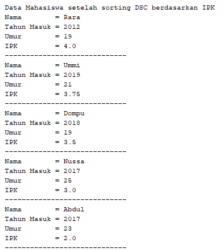
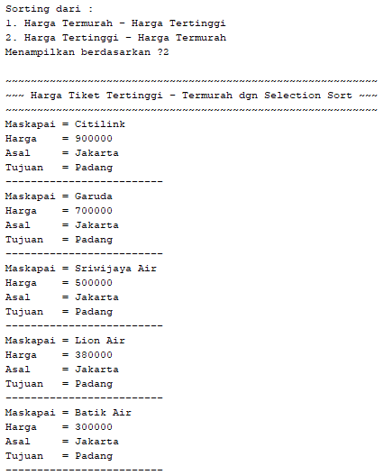

# Laporan Pratikum 6
Syahla' Syafiqah Fayra - 2141720015 - 1F

## 5.2.3 Pertanyaan
1. Terdapat di method apakah proses bubble sort?

    ### Jawaban :

            Proses bubble sort terdapat pada method bubble sort yang bertipe data void yang ada di dalam class daftarMahasiswaBerprestasi

2. Terdapat di method apakah proses selection sort?

    ### Jawaban :

            Proses selection sort terdapat pada method selection sort yang bertipe data void yang ada di dalam class daftarMahasiswaBerprestasi

3. Apakah yang dimaksud proses swap? Tuliskan potongan program untuk melakukan proses swap tersebut!

    ### Jawaban :

            Proses swap adalah proses penukaran, dimana nilai yang di proses pada sorting akan di tukar apabila nilai yang di bandingkan lebih kecil daripada pembandingnya 
    ``` java
        mahasiswa tmp = listMhs[idxMin];
        listMhs[idxMin] = listMhs[i];
        listMhs[i] = tmp;
    ```
4. Di dalam method bubbleSort(), terdapat baris program seperti di bawah ini:

    
    
    Untuk apakah proses tersebut ?

    ### Jawaban :
        
            Kode Program tersebut digunakan untuk proses perbandingan yang akan dilakukan pada method bubble sort. jika nilai yang ada pada elemen [j] lebih besar daripada elemen [j-1] maka akan ada proses swap atau pertukaran.


5. Perhatikan perulangan di dalam bubbleSort() di bawah ini:
    
    

    a. Apakah perbedaan antara kegunaan perulangan i dan perulangan j? 

    ### Jawaban :

            Perulangan i digunakan untuk perulangan pada nilai yang akan menjadi pembanding sedangkan perulangan j digunakan untuk perulangan pada nilai yang akan dibandingkan 

    
    b. Mengapa syarat dari perulangan i adalah i < listMhs.length-1 ?

    ### Jawaban :

            Karena i merupakan perulangan untuk nilai yang posisinya setelah nilai yang akan dibandingkan 

    c. Mengapa syarat dari perulangan j adalah j< listMhs.length-i ?

    ### Jawaban :

            karena j merupakan perulangan untuk nilai yang posisinya sebelum nilai yang akan dugunakan untuk pembanding

    d. Jika banyak data di dalam listMhs adalah 50, maka berapakali perulangan i akan berlangsung? Dan ada berapa Tahap bubble sort yang ditempuh?

    ### Jawaban :

            Jika data dalam listMhs ada 50 maka perulangan i akan 49 kali dan tahap proses bubble sort sebanyak 49 tahap

## 5.3.3. Pertanyaan
1. Di dalam method selection sort, terdapat baris program seperti di bawah ini:
    
    

    Untuk apakah proses tersebut, jelaskan!

    ### Jawaban :

            Baris Program tersebut digunakan untuk melakukan proses sorting yang menggunakan selection sort, dimana nilai i masuk ke int idxMin dan perulangan j dimulai dari data setelah i dan if digunakan untuk menjadi pembandingan antara nilai yang akan dibanding apakah lebih kecil dari idxMin atau nilai i jika benar maka idxMin akan dicetak yaitu j


## 5.4.3 Pertanyaan
1. Ubahlah fungsi pada InsertionSort sehingga fungsi ini dapat melaksanakan proses sorting dengan cara ascending atau decending, anda dapat melakukannya dengan menambahkan parameter pada pemanggilan fungsi insertionSort.

    
    
    ### Jawaban

    Code pada Method insertionSort setelah di Modifikasi

    ``` java
        void insertionSort(boolean asc){
        for(int i=1; i < listMhs.length; i++){ // data pada elemen 1 sudah terurut
            mahasiswa temp = listMhs[i]; // hanya sementara jadi tidak di instasiasi
            int j = i;
            
            if (asc){
                while(j > 0 && listMhs[j-1].ipk > temp.ipk){ // proses swap asc
                    listMhs[j] = listMhs[j-1]; // pertukaran
                    j--;
                }
            } else {
                while(j > 0 && listMhs[j-1].ipk < temp.ipk){ // proses swap dsc
                    listMhs[j] = listMhs[j-1]; // pertukaran
                    j--;
                }
            }
            listMhs[j] = temp; 
        }
    }
    ```

    Hasil Output
    1. Sebelum di sorting

        

    2. Setelah di sorting Ascending

        

    3. Setelah di sorting Descending

        

## 5.5 Latihan Praktikum

Sebuah yang bergerak dalam bidang penjualan tiket pesawat sedang mengembangkan backend untuk sistem pemesanan tiket, salah satu fiturnya adalah menampilkan daftar tiket yang tersedia berdasarkan pilihan filter yang diinginkan user. Daftar tiket ini harus dapat di sorting berdasarkan harga dimulai dari harga termurah ke harga tertinggi. Implementasikanlah class diagram berikut ini kedalam bahasa pemrograman java kemudian buatlah proses sorting data untuk harga tiket menggunakan algoritma bubble sort dan selection sort.


### Jawaban :

1. Code Tiket

    ``` java
    public class tiket {
    String maskapai, asal, tujuan;
    int harga;
    
    tiket(String m , int h, String a, String t){
        maskapai = m;
        harga = h;
        asal = a;
        tujuan = t;
    }
    
        void tampil(){
            System.out.println("Maskapai = "+maskapai);
            System.out.println("Harga    = "+harga);
            System.out.println("Asal     = "+asal);
            System.out.println("Tujuan   = "+tujuan);
        }
    }
    ```

2. Code tiketService

    ``` java
        public class tiketService {
    tiket listTS[] = new tiket[5];
    int ts;
    
    // method tambah ()
    void tambah(tiket t){
        if(ts<listTS.length){
            listTS[ts] = t;
            ts++;
        } else {
            System.out.println("Data Sudah Penuh !!!");
        }
    }
    
    // void tampil()
    void tampilAll(){
        for(tiket t :listTS){
            t.tampil();
            System.out.println("-------------------------");
        }
    }
    
    // void BubbleSort()
    void bubbleSort(boolean asc){
        for(int i = 0; i < listTS.length-1; i++){
            for(int j = 1; j < listTS.length-i; j++){
                
                if(asc) {
                    if(listTS[j].harga < listTS[j-1].harga){
                        // proses swap
                        tiket tmp = listTS[j];
                        listTS[j] = listTS[j-1];
                        listTS[j-1] = tmp;
                    } 
                } else {
                    if(listTS[j].harga > listTS[j-1].harga){
                        // proses swap
                        tiket tmp = listTS[j];
                        listTS[j] = listTS[j-1];
                        listTS[j-1] = tmp;
                    }
                }
            }
        }
    }
    
    // void selectionSort()
    void selectionSort(boolean asc){
        for(int i = 0; i < listTS.length-1; i++){
            int tsMin = i;
            
            if (asc) {
                for(int j=i+1; j < listTS.length; j++){
                    if(listTS[j].harga < listTS[tsMin].harga){
                        tsMin = j;
                    }
                } 
            } else {
                for(int j=i+1; j < listTS.length; j++){
                    if(listTS[j].harga > listTS[tsMin].harga){
                        tsMin = j;
                    }
                } 
            }
            
            // proses swap
            tiket tmp = listTS[tsMin];
            listTS[tsMin] = listTS[i];
            listTS[i] = tmp;
        }
    }
    
    void insertionSort(boolean asc){
        for(int i=1; i < listTS.length; i++){ // data pada elemen 1 sudah terurut
            tiket temp = listTS[i]; // hanya sementara jadi tidak di instasiasi
            int j = i;
            
            if (asc){
                while(j > 0 && listTS[j-1].harga > temp.harga){ // proses swap
                    listTS[j] = listTS[j-1]; // pertukaran
                    j--;
                }
            } else {
                while(j > 0 && listTS[j-1].harga < temp.harga){ // proses swap
                    listTS[j] = listTS[j-1]; // pertukaran
                    j--;
                }
            }
            listTS[j] = temp; 
        }
        }
    }
    ```

3. Code mainTiket

    ``` java
            public class mainTiket {
    public static void main(String[] args){
        Scanner sc = new Scanner (System.in);
        
        System.out.println("~~~~~~~~~~~~~~~~~~~~~~~~~~~~~~~~~~~~~~~~~~~~~~~~~~~~~~~~");
        System.out.println("~~~~~~~~~~~~~~~ PENJUALAN TIKET PESAWAT ~~~~~~~~~~~~~~~~");
        System.out.println("~~~~~~~~~~~~~~~~~~~~~~~~~~~~~~~~~~~~~~~~~~~~~~~~~~~~~~~~");
        System.out.print("Masukkan Asal Penerbangan : ");
        String a = sc.nextLine();
        System.out.print("Masukkan Tujuan Penerbangan : ");
        String t = sc.nextLine();
        
        tiketService list = new tiketService();
        tiket t1 = new tiket("Garuda", 700000, a, t);
        tiket t2 = new tiket("Citilink", 900000, a, t);
        tiket t3 = new tiket("Batik Air", 300000, a, t);
        tiket t4 = new tiket("Lion Air", 380000, a, t);
        tiket t5 = new tiket("Sriwijaya Air", 500000, a, t);
        
        list.tambah(t1);
        list.tambah(t2);
        list.tambah(t3);
        list.tambah(t4);
        list.tambah(t5);
        
        System.out.println("~~~~~~~~~~~~~~~~~~~~~~~~~~~~~~~~~~~~~~~~~~~~~~~~~~~~~~~~");
        System.out.println("~~~~~~~~~~~~ Data Tiket sebelum di sorting ~~~~~~~~~~~~");
        System.out.println("~~~~~~~~~~~~~~~~~~~~~~~~~~~~~~~~~~~~~~~~~~~~~~~~~~~~~~~~");
        list.tampilAll();
        
        System.out.println("Sorting : ");
        System.out.println("1. Bubble Sort");
        System.out.println("2. Selection Sort");
        System.out.println("3. Insertion Sort");
        System.out.print("Sorting Menggunakan : ");
        int sort = sc.nextInt();
        
        switch(sort) {
            case 1 : 
                //Bubble sort
                System.out.println("");
                System.out.println("Sorting dari :");
                System.out.println("1. Harga Termurah - Harga Tertinggi");
                System.out.println("2. Harga Tertinggi - Harga Termurah");
                System.out.print("Menampilkan berdasarkan ?");
                int bub = sc.nextInt();
                
                switch (bub) {
                    case 1 :
                        System.out.println("");
                        System.out.println("~~~~~~~~~~~~~~~~~~~~~~~~~~~~~~~~~~~~~~~~~~~~~~~~~~~~~~~~");
                        System.out.println("~~~ Harga Tiket Termurah - Tertinggi dgn Bubble Sort ~~~");
                        System.out.println("~~~~~~~~~~~~~~~~~~~~~~~~~~~~~~~~~~~~~~~~~~~~~~~~~~~~~~~~");
                        list.bubbleSort(true);
                        list.tampilAll();
                        break;
                    
                    case 2 :
                        System.out.println("");
                        System.out.println("~~~~~~~~~~~~~~~~~~~~~~~~~~~~~~~~~~~~~~~~~~~~~~~~~~~~~~~~");
                        System.out.println("~~~ Harga Tiket Tertinggi - Termurah dgn Bubble Sort ~~~");
                        System.out.println("~~~~~~~~~~~~~~~~~~~~~~~~~~~~~~~~~~~~~~~~~~~~~~~~~~~~~~~~");
                        list.bubbleSort(false);
                        list.tampilAll();
                        break;
                }
                break;
            case 2 : 
                System.out.println("");
                System.out.println("Sorting dari :");
                System.out.println("1. Harga Termurah - Harga Tertinggi");
                System.out.println("2. Harga Tertinggi - Harga Termurah");
                System.out.print("Menampilkan berdasarkan ?");
                int sel = sc.nextInt();
                
                switch(sel){
                    case 1 :
                        System.out.println("");
                        System.out.println("~~~~~~~~~~~~~~~~~~~~~~~~~~~~~~~~~~~~~~~~~~~~~~~~~~~~~~~~~~~");
                        System.out.println("~~~ Harga Tiket Termurah - Tertinggi dgn Selection Sort ~~~");
                        System.out.println("~~~~~~~~~~~~~~~~~~~~~~~~~~~~~~~~~~~~~~~~~~~~~~~~~~~~~~~~~~~");
                        list.selectionSort(true);
                        list.tampilAll();
                        break;
                    case 2 :
                        System.out.println("");
                        System.out.println("~~~~~~~~~~~~~~~~~~~~~~~~~~~~~~~~~~~~~~~~~~~~~~~~~~~~~~~~~~~");
                        System.out.println("~~~ Harga Tiket Tertinggi - Termurah dgn Selection Sort ~~~");
                        System.out.println("~~~~~~~~~~~~~~~~~~~~~~~~~~~~~~~~~~~~~~~~~~~~~~~~~~~~~~~~~~~");
                        list.selectionSort(false);
                        list.tampilAll();
                        break;
                    
                }
                break;
            
            case 3 : 
                System.out.println("");
                System.out.println("Sorting dari :");
                System.out.println("1. Harga Termurah - Harga Tertinggi");
                System.out.println("2. Harga Tertinggi - Harga Termurah");
                System.out.print("Menampilkan berdasarkan ?");
                int ins = sc.nextInt();
                
                switch(ins){
                    case 1 :
                        System.out.println("");
                        System.out.println("~~~~~~~~~~~~~~~~~~~~~~~~~~~~~~~~~~~~~~~~~~~~~~~~~~~~~~~~~~~");
                        System.out.println("~~~ Harga Tiket Termurah - Tertinggi dgn Insertion Sort ~~~");
                        System.out.println("~~~~~~~~~~~~~~~~~~~~~~~~~~~~~~~~~~~~~~~~~~~~~~~~~~~~~~~~~~~");
                        list.insertionSort(true);
                        list.tampilAll();
                        break;
                    case 2 :
                        System.out.println("");
                        System.out.println("~~~~~~~~~~~~~~~~~~~~~~~~~~~~~~~~~~~~~~~~~~~~~~~~~~~~~~~~~~~");
                        System.out.println("~~~ Harga Tiket Tertinggi - Termurah dgn Insertion Sort ~~~");
                        System.out.println("~~~~~~~~~~~~~~~~~~~~~~~~~~~~~~~~~~~~~~~~~~~~~~~~~~~~~~~~~~~");
                        list.insertionSort(false);
                        list.tampilAll();
                        break;
                }
                break;
            }        
        }
    }
    ```

4. Hasil output

    A. Sebelum disorting 
    
    

    B. Pemilihan Sorting

    

    - Bubble Sort
    
        
        


    - Selection Sort

        
        

    - Insertion Sort

        
        


