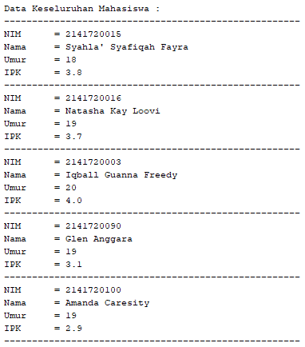

# Laporan Pratikum 7
Syahla' Syafiqah Fayra - TI 1F - 2141720015

## 6.2.3. Pertanyaan
1. Jelaskan perbedaan method TampilData dan Tampilposisi pada class PencarianMhs !
    
    ### Jawaban :
            Method tampilData digunakan untuk mencetak value atau isi data pada objek mahasiswa sedangkan tampilPosisi digunakan untuk menampilkan posisi atau indeks dari value data tersebut

2. Jelaskan fungsi break pada kode program dibawah ini !

    

    ### Jawaban :
            Fungsi Break adalah untuk menghentikan terjadinya looping pada sebuah program. Jadi ketika diantara data nim pada array tersebut ditemukan sama dengan yang dicari atau yang input maka looping akan dihentikan

3. Jika Data Nim yang dimasukkan tidak terurut dari kecil ke besar. Apakah program masih dapat
berjalan? Apakah hasil yang dikeluarkan benar? Mengapa demikian!
   
    ### Jawaban :
    
   

   

            Program tetap berjalan dan hasil yang dikeluarkan juga benar namun tidak urut. Terjadi seperti itu  karena pada method sequential search, data yang ingin dicari akan dicocokan dengan masing – masing data pada suatu array secara urut dari indeks awal hingga akhir. Oleh karena itu, pencarian data dengan sequential search tidak membutuhkan suatu kumpulan data yang urut.

## 6.3.3. Pertanyaan
1. Tunjukkan pada kode program yang mana proses divide dijalankan!

    ### Jawaban :
        
        int mid;
        if(right >= left){
            mid = (left+right)/2;
            if(cari == listMhs[mid].nim){

    Kode diatas digunakan pada proses divide yaitu dengan membagi array menjadi 3 bagian yaitu left, mid, dan right

2. Tunjukkan pada kode program yang mana proses conquer dijalankan!
 
    ### Jawaban :

        }else if (listMhs[mid].nim > cari){
            return FindBinarySearch(cari, left, mid -1);
        }else {
             return FindBinarySearch(cari, mid+1, right);
        }

    Kode diatas digunakan pada proses conquer yaitu dengan membagi bagian bagian menjadi subarray dengan menggunakan fungsi rekursif

3. Jika data Nim yang dimasukkan tidak urut. Apakah program masih dapat berjalan? Mengapa
demikian!
 
    ### Jawaban :
   

   

        Program masih dapat berjalan namun hasil yang dikeluarkan belum tentu benar seperti gambar output diatas jika kita mencari nim 2018 maka tidak ditemukan, hal ini terjadi karena ketika sebuah deretan data yang tidak urut akan dibagi 2 lalu program ingin menentukan sisi mana yang akan diseleksi, maka program kemungkinan besar akan mengambil keputusan yang salah karena belum tentu di salah satu sisi tersebut memiliki semua data yang lebih besar atau lebih kecil dari data yang berada pada posisi tengah array. Tetapi karena yang dicari nim 2021 maka output yang dikeluarkan sesuai yaitu pada index ke - 4

4. Jika Nim yang dimasukkan dari NIM terbesar ke terkecil (missal : 20215, 20214, 20212, 20211, 20210) dan elemen yang dicari adalah 20210. Bagaimana hasil dari binary search? Apakah sesuai? Jika tidak sesuai maka ubahlah kode program binary seach agar hasilnya sesuai
 
    ### Jawaban :
        Hasil tidak dapat ditemukan karena ada fungsi yang salah. Agar sesuai maka bisa dengan mengubah program dari 

    

        Menjadi seperti program dibawah ini
    
    

        Maka akan menghasilkan Output seperti dibawah ini. Dan datanya dapat ditemukan.

    

    

5. Modifikasilah program diatas yang mana jumlah mahasiswa yang di inputkan sesuai dengan
masukan dari keyboard.
 
    ### Jawaban :
        Kode Program : 

    ``` java 
        public class pencarianMhs {  
            int elemen;
            int idx;
            mahasiswa listMhs[];
            
            public pencarianMhs(int jml){
                elemen = jml;
                listMhs = new mahasiswa[elemen];
            }
        
        public class mahasiswaMain {
            System.out.print("Masukkan Jumlah Mahasiswa : ");
            int jumMhs = s.nextInt();
            pencarianMhs data = new pencarianMhs(jumMhs);
    ```

        Hasil :
    
   

   

## 6.5. Latihan Praktikum
1. Modifikasi percobaan searching diatas dengan ketentuan berikut ini
    - Sebelum dilakukan searching dengan binary search data harus dilakukan pengurutan dengan menggunakan algoritma sorting (pilih salah satu algoritma sorting dari pertemuan sebelumnya)

        ### Jawaban :
        - Kode Program mahasiswa
            ``` java
                public class mahasiswa {
                int nim;
                String nama;
                int umur;
                double ipk;
                
                mahasiswa( int ni, String n, int u, double i){
                    nim = ni;
                    nama = n;
                    umur = u;
                    ipk = i;
                }
                
                void tampil(){
                    System.out.println("NIM\t = " + nim);
                    System.out.println("Nama\t = " + nama);
                    System.out.println("Umur\t = " + umur);
                    System.out.println("IPK\t = " + ipk);
                }
                
            }
            ```

        - Kode Program pencarianMhs
            ``` java
                        public class pencarianMhs {
                mahasiswa listMhs[] = new mahasiswa[5];
                int idx;
                
                void tambah(mahasiswa m){
                    if(idx < listMhs.length){
                        listMhs[idx] = m; //proses penambahan data
                        idx ++;
                    } else {
                        System.out.println("Data Sudah Penuh !!");
                    }
                }
                
                void tampil(){
                    for(mahasiswa m : listMhs){
                        m.tampil(); // ngambil tampil di dalam kelas mahasiswa
                        System.out.println("-----------------------------------------------------");
                    }
                }
                
                public int findSeqSearch( int cari ){
                    int posisi = -1; // menandakan nilainya posisi
                    for ( int j = 0; j < listMhs.length; j++){ 
                        if ( listMhs[j].nim == cari) { // proses pencari kesamaaan antar nim nim yang ada dengan nim yang ingin dicari
                            posisi = j; // j adalah nim yang dicari
                            break; 
                        }
                    }
                    return posisi;
                }
                
                void bubblesort() {
                    for (int i = 0; i < listMhs.length - 1; i++) {
                        for (int n = 1; n < listMhs.length - i; n++) {
                            if (listMhs[n].nim < listMhs[n - 1].nim) {
                                mahasiswa tmp = listMhs[n];
                                listMhs[n] = listMhs[n - 1];
                                listMhs[n - 1] = tmp;
                            }
                        }
                    }
                }
                
                public int findBinarySearch(int cari, int left, int right){ // left = i,right = j
                    int mid;
                    if(right >= left){ 
                        mid = (left + right) / 2; // proses pencarian proses nilai tengah
                        if (cari == listMhs[mid].nim){ // jika nilai mid = nilai cari
                            return mid;
                        } else if (listMhs[mid].nim > cari) { // jika lebih dari nilai cari
                            return findBinarySearch(cari, left, mid - 1); // left tetep karena wilayah kiri
                        } else { // jika kurang dari nilai cari
                            return findBinarySearch(cari, mid + 1, right); // nilai tengah ditambah 1 dan nilai j nya tetep
                        }
                    }
                    return -1; 
                }
                
                // untuk menampilkan posisi
                public void tampilPosisi (int x, int pos){ // x = nilainya, pos = posisi
                    if (pos != -1){  
                        System.out.println("Data " + x + " Ditemukan pada indeks ke - " + (pos));
                    } else {
                        System.out.println("Data " + x + " Tidak Ditemukan");
                    }
                }
                
                
                public void tampilData(int x, int pos){
                    if (pos!= -1){ // jika datanya ditemukan
                        System.out.println("NIM\t : " + x);
                        System.out.println("Nama\t : " + listMhs[pos].nama);
                        System.out.println("Umur\t : " + listMhs[pos].umur);
                        System.out.println("IPK\t : " + listMhs[pos].ipk);
                    } else {
                        System.out.println("Data " + x + "Tidak Ditemukan");
                    }
                }
            }
            ```
        - Kode Program mahasiswaMain :
            ``` java
            public class mahasiswaMain {
                public static void main(String[] args) {
                    Scanner s = new Scanner (System.in);
                    Scanner sl = new Scanner (System.in);
                    
                    pencarianMhs data = new pencarianMhs();
                    int jumMhs = 5;
                    
                    System.out.println("-----------------------------------------------------");
                    System.out.println("------------- Masukkan Data Mahasiswa ---------------");
                    
                    for(int i = 0; i < jumMhs; i++){
                        System.out.println("-----------------------------------------------------");
                        System.out.print("NIM\t : ");
                        int nim = s.nextInt();
                        System.out.print("Nama\t : ");
                        String nama = sl.nextLine();
                        System.out.print("Umur\t : ");
                        int umur = s.nextInt();
                        System.out.print("IPK\t : ");
                        double ipk = s.nextDouble();
                        
                        mahasiswa m = new mahasiswa (nim, nama, umur, ipk);
                        data.tambah(m);
                    }
                    
                    System.out.println();
                    System.out.println("Data Keseluruhan Mahasiswa : ");
                    System.out.println("-----------------------------------------------------");
                    data.tampil();
                    
                    System.out.println();
                    System.out.println("Data Mahasiswa setelah di Sorting : ");
                    System.out.println("-----------------------------------------------------");
                    data.bubblesort();
                    data.tampil();
                    
                    System.out.println("");
                    System.out.println("_____________________________________________________");
                    System.out.println("Pencarian Data");
                    System.out.println("");
                    System.out.print("Masukkan NIM Mahasiswa yang dicari : ");
                    int cari = s.nextInt();
                
                    
                    System.out.println("-----------------------------------------------------");
                    System.out.println("Menggunakan Binary Search");
                    int posisi = data.findBinarySearch(cari, 0, jumMhs - 1);
                    data.tampilPosisi(cari, posisi);
                    data.tampilData(cari, posisi);
                }
            }
            ```   
        
        - Hasil Output

            

            

            

            

2. Modifikasi percobaan searching diatas dengan ketentuan berikut ini
    - Pencarian dilakukan berdasarkan Nama Mahasiswa (gunakan Algoritma Sequential Search)
    - Jika terdapat nama yang sama? Bagaimana keluaran dari kode program ketika pencarian dilakukan pada nama yang sama!

        ### Jawaban :

        - Kode Program Mahasiswa
            
                Sama Seperti Pratikum 1
        
        - Kode Program pencarianMhs 

            ``` java
            public class pencarianMhs {
                mahasiswa listMhs[] = new mahasiswa[5];
                int idx;
                
                void tambah(mahasiswa m){
                    if(idx < listMhs.length){
                        listMhs[idx] = m; //proses penambahan data
                        idx ++;
                    } else {
                        System.out.println("Data Sudah Penuh !!");
                    }
                }
                
                void tampil(){
                    for(mahasiswa m : listMhs){
                        m.tampil(); // ngambil tampil di dalam kelas mahasiswa
                        System.out.println("-----------------------------------------------------");
                    }
                }
                
                public int findSeqSearch(String nama){
                    int posisi = -1;
                    for ( int j = 0; j < listMhs.length; j++){ 
                        if ( listMhs[j].nama.equalsIgnoreCase(nama)) { 
                            posisi = j;
                            break;
                        }
                    }
                    return posisi;
                }
                
                
                // untuk menampilkan posisi
                public void tampilPosisi (String x, int pos){ // x = nilainya, pos = posisi
                        if (pos != -1){  
                            System.out.println("Data " + x + " Ditemukan pada indeks ke - " + (pos));
                        } else {
                            System.out.println("Data " + x + " Tidak Ditemukan");
                    }
                }
                
                
                public void tampilData(String x, int pos){
                    if (pos!= -1){ // jika datanya ditemukan
                        System.out.println("NIM\t : " + listMhs[pos].nim);
                        System.out.println("Nama\t : " + x);
                        System.out.println("Umur\t : " + listMhs[pos].umur);
                        System.out.println("IPK\t : " + listMhs[pos].ipk);
                    } else {
                        System.out.println("Data " + x + "Tidak Ditemukan");
                    }
                }
            }
            ```
        
        - Kode Program mahasiswaMain
            ``` java
            public class mahasiswaMain {
                public static void main(String[] args) {
                    Scanner s = new Scanner (System.in);
                    Scanner sl = new Scanner (System.in);
                    
                    pencarianMhs data = new pencarianMhs();
                    int jumMhs = 5;
                    
                    System.out.println("-----------------------------------------------------");
                    System.out.println("------------- Masukkan Data Mahasiswa ---------------");
                    
                    for(int i = 0; i < jumMhs; i++){
                        System.out.println("-----------------------------------------------------");
                        System.out.print("NIM\t : ");
                        int nim = s.nextInt();
                        System.out.print("Nama\t : ");
                        String nama = sl.nextLine();
                        System.out.print("Umur\t : ");
                        int umur = s.nextInt();
                        System.out.print("IPK\t : ");
                        double ipk = s.nextDouble();
                        
                        mahasiswa m = new mahasiswa (nim, nama, umur, ipk);
                        data.tambah(m);
                    }
                    
                    System.out.println("-----------------------------------------------------");
                    System.out.println("----------- Data Keseluruhan Mahasiswa : ------------");
                    System.out.println("-----------------------------------------------------");
                    data.tampil();
                
                    System.out.println("_____________________________________________________");
                    System.out.println("Pencarian Data");
                    System.out.println("");
                    System.out.print("Masukkan Nama Mahasiswa yang dicari : ");
                    String nama = sl.nextLine();
                
                    System.out.println("=====================================================");
                    System.out.println("Menggunakan sequntial Search : ");
                    int posisi = data.findSeqSearch(nama);
                    
                    data.tampilPosisi(nama, posisi);
                    data.tampilData(nama, posisi);
                    
                }
            }
            ```

        - Hasil Output:

           

           

        - Penjelasan 

                Output Hanya akan mengeluarkan suatu objek yang memiliki nama yang sama seperti yang inputkan. jika terdapat banyak nama yang sama, maka yang akan dikeluarkan adalah indeks pertama dari nama tersebut. Karena memiliki fungsi break yang berfungsi untuk menghentikan looping ketika telah menemukan nama yang cocok dengan yang ingin di cari.


3. Terdapat sebuah data array 1 dimensi sebagai berikut 
 
    

    Buatlah program untuk mengurutkan array tersebut (boleh memilih metode pengurutan) selanjutnya lakukan pencarian dan mencetak isi array yang nilainya terbesar, dan mencetak ada berapa buah nilai terbesar tersebut serta berada dilokasi mana saja nilai terbesar tersebut!(menggunakan binary search)

    ### Jawaban :
    
    - Kode program data

        ``` java
        public class data {
            
            public int[] data;
            public int max = 0;
            public int posisi;
            public int jum = 0;
            
            data(int nilai[]){
                data = nilai;
            }
            
            void tampil() {
                for (int i = 0; i < data.length; i++) {
                    System.out.print(data[i] + " " + " ");
                }
            }

            void bubblesort() {
                for (int i = 0; i < data.length - 1; i++) {
                    for (int n = 1; n < data.length - i; n++) {
                        if (data[n] > data[n - 1]) {
                            int tmp = data[n];
                            data[n] = data[n - 1];
                            data[n - 1] = tmp;
                        }
                    }
                }
            }

            public int Searching(int cari, int kiri, int kanan) {
                int mid;
                if (kanan >= kiri) {
                    mid = (kiri + kanan) / 2;
                    if (cari == data[mid]) {
                        return (mid);
                    } else if (data[mid] > cari) {
                        return Searching(cari, mid + 1, kanan);
                    } else {
                        return Searching(cari, kiri, mid - 1);
                    }
                }
                return -1;
            }
            

            public int nilaiTerbesar() {
                for (int i = 0; i < data.length; i++) {
                    if (data[i] > max) {
                        max = data[i];
                    }
                }
                System.out.println("Nilai terbesar\t : " + max);
                return max;
            }

            public void tampilPosisi(int pos) {
                for (int i = 0; i < data.length; i++) {
                    if (data[i] == max) {
                        jum++;
                    }
                }
                System.out.print("terdapat\t : " + jum + " data");
                System.out.println();
                posisi = max;
                for (int i = 0; i < data.length; i++) {
                    if (posisi == data[i]) {
                        pos = i;
                        System.out.println("------------------------------------------------------");
                        System.out.println("Data ditemukan pada indeks ke-" + pos);
                    }
                }
            } 
        }
        ```
    - Kode Program dataMain

        ``` java
        public class dataMain {
            public static void main(String[] args) {
                int dataArray[] = {12, 7, 2 , 1, 70, 50, 90, 17, 2, 90};
                
                data dt = new data(dataArray);
                
                int jumlah = 10;
                int max = 0;
                
                System.out.println("~~~~~~~~~~~~~~~~~~~~~~~~~~~~~~~~~~~~~~~~~~~~~~~~~~~~~~");
                System.out.println("~~~~~~~~~~~~~~~~~~~~~ Data Array ~~~~~~~~~~~~~~~~~~~~~");
                System.out.println("~~~~~~~~~~~~~~~~~~~~~~~~~~~~~~~~~~~~~~~~~~~~~~~~~~~~~~");
                System.out.println("Sebelum di sorting : ");
                dt.tampil();
                dt.bubblesort();
                System.out.println("");
                System.out.println("~~~~~~~~~~~~~~~~~~~~~~~~~~~~~~~~~~~~~~~~~~~~~~~~~~~~~~");
                System.out.println("Setelah di sorting : ");
                dt.tampil();
                System.out.println("");
                System.out.println("------------------------------------------------------");
                dt.nilaiTerbesar();
                dt.Searching(max, 0, jumlah - 1);
                dt.tampilPosisi(max);
            }
        }
        ```

    - Hasil Output

        