# Laporan Pratikum 9
Syahla' Syafiqah Fayra - TI 1F - 2141720015

## 7.2.3. Pertanyaan
1. Berapa banyak data pakaian yang dapat ditampung di dalam stack? Tunjukkan potongan kode program untuk mendukung jawaban Anda tersebut!
 
    ### Jawaban :
    
        Terdapat 5 data pakaian yang akan ditampung di dalam stack
    ``` java
    stack stk = new stack(5);
    ```


            
2. Perhatikan class StackMain, pada saat memanggil fungsi push, parameter yang dikirimkan adalah p. Data apa yang tersimpan pada variabel p tersebut?

    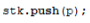

    ### Jawaban : 
    
        Data yang disimpan adalah data teratas dari indeks array


3. Apakah fungsi penggunaan do-while yang terdapat pada class StackMain?

    ### Jawaban :
    
        fungsi do while di dalam class stackMain adalah untuk melakukan perulangan jadi akan ada pilihan y/n jika milih y maka akan jalan lagi proses penambahan stack sampai batas atau kapasitas yang telah di tentukan sebelumnya. dan jika milih n maka akan lanjut ke proses berikutnya


4. Modifikasi kode program pada class StackMain sehingga pengguna dapat memilih operasi - operasi pada stack (push, pop, peek, atau print) melalui pilihan menu program dengan memanfaatkan kondisi IF-ELSE atau SWITCH-CASE

    ### Jawaban : 
    - Kode

        ``` java
        public static void main(String[] args) {
                stack stk = new stack(5);
                
                Scanner sc = new Scanner(System.in);
                
                int menu;
                char pilih;
                do {
                    System.out.println("||||||||||||||||||||||||||||||||||||||||||||||||||||||||||||");
                    System.out.println("|||||||||||||||||||||| Stack Pakaian |||||||||||||||||||||||");
                    System.out.println("||||||||||||||||||||||||||||||||||||||||||||||||||||||||||||");
                    System.out.println("1. Push");
                    System.out.println("2. Pop");
                    System.out.println("3. Peek");
                    System.out.println("4. Print");
                    System.out.print("Masukkan pilihan : ");
                    menu = sc.nextInt();
                    switch(menu){
                        case 1:
                            System.out.println("||||||||||||||||||||||||||||||||||||||||||||||||||||||||||||");
                            System.out.println("|||||||||||||||||||| Penambahan Pakaian ||||||||||||||||||||");
                            System.out.println("||||||||||||||||||||||||||||||||||||||||||||||||||||||||||||");
                            do {
                                System.out.print("Jenis  : ");
                                String jenis = sc.next();
                                System.out.print("Warna  : ");
                                String warna = sc.next();
                                System.out.print("Merk   : ");
                                String merk = sc.next();
                                System.out.print("Ukuran : ");
                                String ukuran = sc.next();
                                System.out.print("Harga  : ");
                                double harga = sc.nextDouble();

                                pakaian p = new pakaian(jenis, warna, merk, ukuran, harga);
                                System.out.print("Apakah anda akan menambahkan data baru ke stack (y/n)? ");
                                pilih = sc.next().charAt(0);
                                sc.nextLine();
                                stk.push(p);
                            } while (pilih == 'y');
                            break;
                        case 2:
                            System.out.println("||||||||||||||||||||||||||||||||||||||||||||||||||||||||||||");
                            System.out.println("||||||||||||||||||| Mengeluarkan Pakaian |||||||||||||||||||");
                            System.out.println("||||||||||||||||||||||||||||||||||||||||||||||||||||||||||||");
                            stk.pop();
                            break;
                        case 3:
                            System.out.println("||||||||||||||||||||||||||||||||||||||||||||||||||||||||||||");
                            System.out.println("||||||||||||||||||| Pakaian yang Teratas |||||||||||||||||||");
                            System.out.println("||||||||||||||||||||||||||||||||||||||||||||||||||||||||||||");
                            stk.peek();
                            break;
                        case 4:
                            System.out.println("||||||||||||||||||||||||||||||||||||||||||||||||||||||||||||");
                            System.out.println("|||||||||||||||||||| Data Stack Pakaian ||||||||||||||||||||");
                            System.out.println("||||||||||||||||||||||||||||||||||||||||||||||||||||||||||||");
                            stk.print();
                            break;
                        default:
                            System.out.print("Angka yang dimasukkan salah!");
                            break;
                    }
                    
                } while (menu !=4);
            }
        ```
    - Hasil

        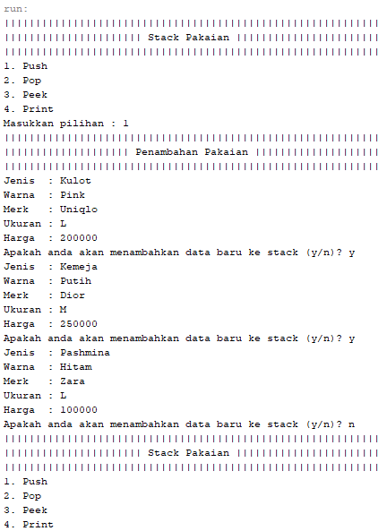  

        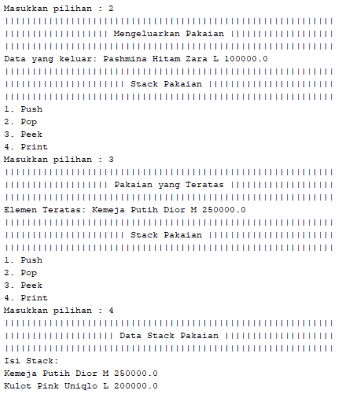  

## 7.3.3. Pertanyaan
1. Perhatikan class Postfix, jelaskan alur kerja method derajat!

    ### Jawaban :
    
        Method derajat digunakan untuk membandingkan serta menentukan derajat mana yang paling tinggi, derajat yang paling kuat adalah ^ (pangkat) maka akan return 3, operator dari * (kali) dan / (bagi) maka akan return 2, sedangkan untuk operator + (tambah) dan - (kurang) maka akan return 1. Kondisi default adalah return 0

2. Apa fungsi kode program berikut?

    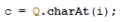

    ### Jawaban :
        
        untuk proses melakukan pembacaan karakter dan setelah dibaca karakter tersebut akan dimasukkan sesuai dengan kriteria nya dan lanjut ke proses selanjutnya


3. Jalankan kembali program tersebut, masukkan ekspresi 3*5^(8-6)%3. Tampilkan hasilnya!

    ### Jawaban :

    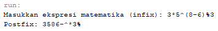

4. Pada soal nomor 3, mengapa tanda kurung tidak ditampilkan pada hasil konversi? Jelaskan!

    ### Jawaban : 

        Karena tanda kurung tidak ditampilkan pada hasil konversi karena postfix tidak memerlukan tanda kurung operator yang akan mengeluarkan seluruh isi stack termasuk kedua tanda kurung karena diantara tanda kurung hanya ada + (tambah) maka + (tambah) saja yang dijadikan hasil atau operator 2 yang akan menjadi hasil bersama dengan operandnya, disini tanda kurung berfungsi untuk membatas bagi operasi nilai yang ada didalamnya.

## 7.4 Tugas
1. Perhatikan dan gunakan kembali kode program pada Praktikum 1. Tambahkan method getMin pada class Stack yang digunakan untuk mencari dan menampilkan data pakaian dengan harga terendah dari semua data pakaian yang tersimpan di dalam stack!

    ### Jawaban :
    - method getMin
        ``` java
        public void getMin(){  
            if (!isEmpty()){
                int min = 0;
                for (int i = 0; i <= top; i++){
                    if(data[min].harga > data[i].harga){
                        min = i;
                    }
                }
                System.out.println("Harga Pakaian Termurah: " + data[min].jenis + " " + data[min].warna + " " + data[min].merk + " " + data[min].ukuran + " " + data[min].harga);
            } else {
                    System.out.println("Stack Kosong!!");
            }
        }   
        ```

    - pemanggilan method pada class main
        ``` java
        stk.getMin();
        ```

    - Hasil 

        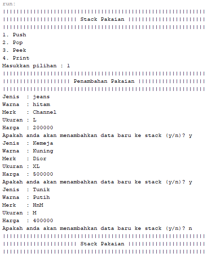

        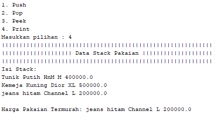

2. Setiap hari Minggu, Dewi pergi berbelanja ke salah satu supermarket yang berada di area rumahnya. Setiap kali selesai berbelanja, Dewi menyimpan struk belanjaannya di dalam laci. Setelah dua bulan, ternyata Dewi sudah mempunyai delapan struk belanja. Dewi berencana mengambil lima struk belanja untuk ditukarkan dengan voucher belanja.Buat sebuah program stack untuk menyimpan data struk belanja Dewi, kemudian lakukan juga proses pengambilan data struk belanja sesuai dengan jumlah struk yang akan ditukarkan dengan voucher. Informasi yang tersimpan pada struk belanja terdiri dari:
    - Nomor transaksi
    - Tanggal pembelian
    - Jumlah barang yang dibeli
    - Total harga bayar

    Tampilkan informasi struk belanja yang masih tersimpan di dalam stack

    ### Jawaban :
    - Kode program struk

        ``` java
        public class struk {
            int nomorTransaksi, jmlBrg;
            String tgl;
            double total;
            
            struk(int nomorTransaksi, String tgl, int jmlBrg, double total){
                this.nomorTransaksi = nomorTransaksi;
                this.tgl = tgl;
                this.jmlBrg = jmlBrg;
                this.total = total;
            }
        }
        ```

    - Kode program stack

        ``` java
            public class stack {
            int size, top;
            struk data[];
            
            public stack(int size){
                this.size = size;
                data = new struk[size];
                top = -1;
            }
            
            public boolean isEmpty() { 
                if (top == -1){ 
                    return true; 
                } else { 
                    return false;
                }
            }
            
            public boolean isFull() {
                if (top == size -1){ 
                    return true;
                } else {
                    return false;
                }
            }
            
            public void push(struk st){
                if(!isFull()){ 
                    top++;
                    data[top] = st;
                } else {
                    System.out.println("isi stack penuh!");
                }
            }
            
            public void pop() { 
                if(!isEmpty()){
                    struk x = data[top]; 
                    top--; 
                    System.out.println("Nomor Transaksi   : " + x.nomorTransaksi);
                    System.out.println("Tanggal Pembelian : " + x.tgl);
                    System.out.println("Jumlah Barang     : " + x.jmlBrg);
                    System.out.println("Total Harga Bayar : " + x.total);
                    System.out.println("=======================================================");
                } else {
                    System.out.println("Stack Masih Kosong");
                }
            }
            
            public void peek(){
                System.out.println("~~~~~~~~~~~~~~~~~~~~~~~~~~~~~~~~~~~~~~~~~~~~~~~~~~~~~~~");
                System.out.println("~~~~~~~~~~~~ D A T A - S T R U K - TERATAS ~~~~~~~~~~~~");
                System.out.println("~~~~~~~~~~~~~~~~~~~~~~~~~~~~~~~~~~~~~~~~~~~~~~~~~~~~~~~");
                System.out.println("Nomor Transaksi   : " + data[top].nomorTransaksi);
                System.out.println("Tanggal Pembelian : " + data[top].tgl);
                System.out.println("Jumlah Barang     : " + data[top].jmlBrg);
                System.out.println("Total Harga Bayar : " + data[top].total);
            }
            
            public void print() {
                System.out.println("~~~~~~~~~~~~~~~~~~~~~~~~~~~~~~~~~~~~~~~~~~~~~~~~~~~~~~~");
                System.out.println("~~~~~~~~~~~~        ISI DATA STACK         ~~~~~~~~~~~~");
                System.out.println("~~~~~~~~~~~~~~~~~~~~~~~~~~~~~~~~~~~~~~~~~~~~~~~~~~~~~~~");
                for ( int i = top; i >= 0; i --){
                    System.out.println("Nomor Transaksi   : " + data[i].nomorTransaksi);
                    System.out.println("Tanggal Pembelian : " + data[i].tgl);
                    System.out.println("Jumlah Barang     : " + data[i].jmlBrg);
                    System.out.println("Total Harga Bayar : " + data[i].total);
                    System.out.println("");
                }
                System.out.println("");
            }
            
            public void clear() {
                if (!isEmpty()) {
                    for (int i = top; i >= 0; i--){
                        top--;
                    }
                    System.out.println("Stack sudah dikosongkan");
                } else {
                    System.out.println("Stack masih kosong");
                }
            }
        }
        ```

    - Kode program Main

        ``` java
        public class strukMain {
            public static void main(String[] args) {
                stack stk = new stack(10);
                
                Scanner sc = new Scanner(System.in);
                Scanner scS = new Scanner(System.in);
            
                char pilih;
                do {
                    System.out.println("~~~~~~~~~~~~~~~~~~~~~~~~~~~~~~~~~~~~~~~~~~~~~~~~~~~~~~~");
                    System.out.println("~~~~~~~~~~~~         STRUK BELANJA         ~~~~~~~~~~~~");
                    System.out.println("~~~~~~~~~~~~~~~~~~~~~~~~~~~~~~~~~~~~~~~~~~~~~~~~~~~~~~~");
                    System.out.print("Nomor Transaksi          : ");
                    int nomorTransaksi = sc.nextInt();
                    System.out.print("Tanggal Pembelian        : ");
                    String tgl = scS.nextLine();
                    System.out.print("Jumlah Barang yang dibeli: ");
                    int jmlBrg = sc.nextInt();
                    System.out.print("Total Harga Bayar        : ");
                    double total = sc.nextDouble();
                    System.out.println("");
                    
                    struk st = new struk(nomorTransaksi, tgl, jmlBrg, total);
                    System.out.print("Apakah anda akan menambahkan data baru (y/n)? ");
                    pilih = sc.next().charAt(0);
                    sc.nextLine();
                    stk.push(st);
                } while (pilih == 'y');
                
                stk.print();
                System.out.println("~~~~~~~~~~~~~~~~~~~~~~~~~~~~~~~~~~~~~~~~~~~~~~~~~~~~~");
                System.out.print("Masukkan Jumlah Struk yang ditukarkan Voucher : ");
                
                int jml = sc.nextInt();
                System.out.println("~~~~~~~~~~~~~~~~~~~~~~~~~~~~~~~~~~~~~~~~~~~~~~~~~~~~~~~");
                System.out.println("~~~~~~~~~~~~     STRUK YANG DITUKARKAN     ~~~~~~~~~~~~");
                System.out.println("~~~~~~~~~~~~~~~~~~~~~~~~~~~~~~~~~~~~~~~~~~~~~~~~~~~~~~~");
                for(int i = 0; i < jml; i++){
                    stk.pop();
                }
                
                System.out.println("");
                stk.peek();
                System.out.println("");
                stk.print();
            }
        }
        ```

    - Hasil 

        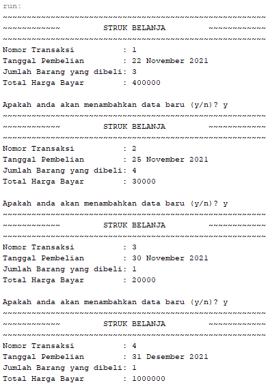

        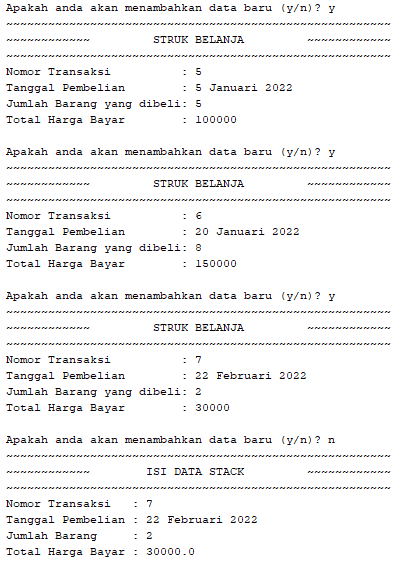

        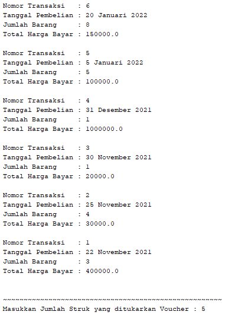

        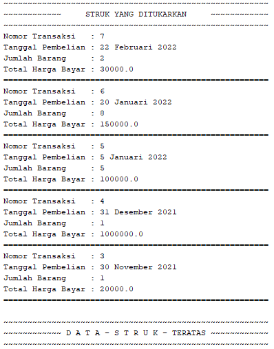

        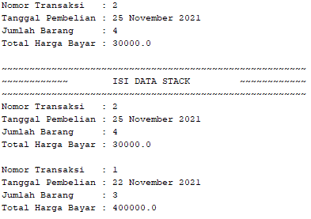